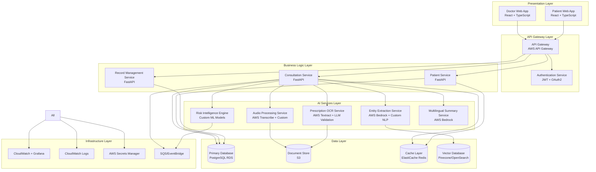
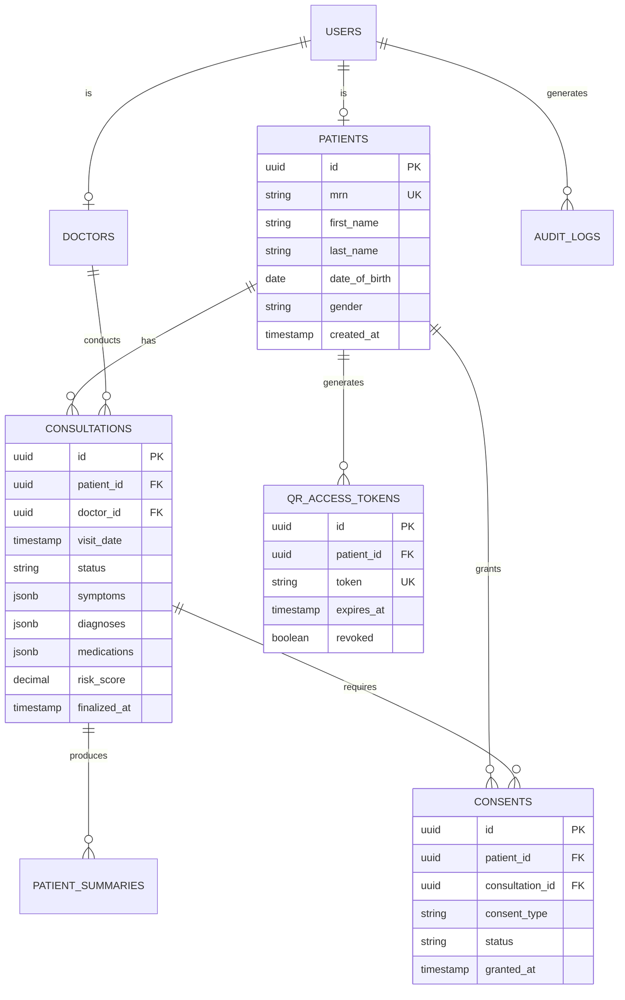
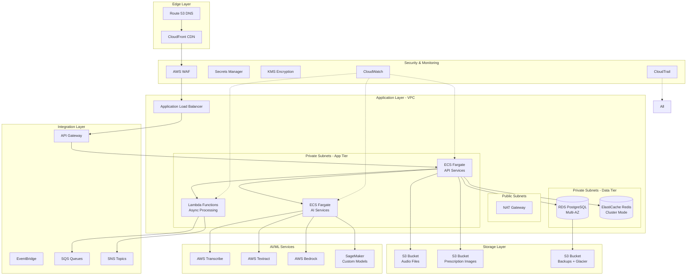
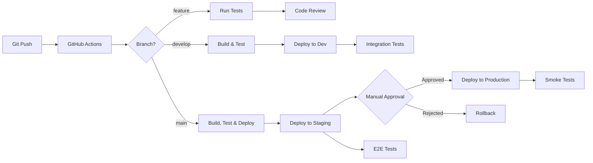

# Design Document: SwasthyaSetu AI

## Overview

SwasthyaSetu AI is an enterprise-grade, AI-powered clinical documentation and portable patient health record system designed specifically for the Indian healthcare ecosystem. The system employs a modular, cloud-native architecture that processes multimodal inputs (audio, text, prescription images) through specialized AI pipelines to generate structured medical records, detect health risks, and provide longitudinal patient care insights.

The architecture prioritizes:
- **Modularity**: Clear separation of concerns enabling independent scaling and maintenance
- **AI-First Design**: Deep integration of ML/NLP models throughout the data pipeline
- **Security & Compliance**: Enterprise-grade encryption, RBAC, and audit logging
- **Scalability**: Cloud-native patterns supporting horizontal scaling
- **Responsible AI**: Human-in-the-loop design with transparency and oversight
- **Indian Healthcare Context**: Multilingual support, handwritten prescription OCR, high-volume clinic optimization

### Architectural Philosophy

The system follows a **microservices-oriented architecture** with clear boundaries between:
1. **Presentation Layer**: Modern web interfaces for doctors and patients
2. **API Gateway Layer**: Unified entry point with authentication and routing
3. **Business Logic Layer**: Core services for consultation management and orchestration
4. **AI Services Layer**: Specialized AI/ML components for transcription, extraction, and risk analysis
5. **Data Layer**: Persistent storage with encryption and backup strategies
6. **Infrastructure Layer**: Cloud services, monitoring, and security

This separation enables:
- Independent deployment and scaling of AI-intensive components
- Technology flexibility (different AI models can be swapped without affecting business logic)
- Clear testing boundaries and fault isolation
- Future extensibility for new features and integrations


## System Architecture

### High-Level Architecture Diagram



### Architecture Justification

**Why Microservices-Oriented Architecture?**

1. **AI Component Isolation**: AI services (ASR, NLP, OCR, Risk Engine) have different resource requirements and scaling patterns than business logic. Separating them allows:
   - Compute-optimized instances depending on AI workload requirements.
   - Independent scaling based on workload (e.g., OCR may need more capacity during peak hours)
   - Model updates without affecting core business logic

2. **Technology Flexibility**: Each service can use the optimal technology stack:
   - FastAPI for high-performance Python APIs
   - AWS managed services for proven AI capabilities
   - Custom models where domain-specific requirements exist

3. **Fault Isolation**: Failure in one AI service (e.g., OCR) doesn't bring down the entire system. Consultations can still be documented via audio or text.

4. **Development Velocity**: Teams can work independently on different services with clear contracts (APIs), enabling parallel development.

5. **Cost Optimization**: AI services can be scaled down during off-peak hours, while core services maintain availability.

**Why Cloud-Native (AWS)?**

1. **Managed AI Services**: AWS Transcribe, Textract, and Bedrock provide production-ready AI capabilities with built-in scaling, reducing development time and operational overhead.

2. **Compliance & Security**: AWS provides HIPAA-eligible services, encryption at rest/transit, and comprehensive audit logging required for healthcare data.

3. **Global Reach**: Multi-region deployment capability for disaster recovery and low-latency access across India.

4. **Operational Excellence**: Managed services reduce operational burden, allowing focus on business logic and AI model improvement.


## Modern UI/UX Design Philosophy

### Design Principles

**1. Clinical Minimalism**
- Clean, distraction-free interface optimized for high-volume clinical workflows
- Information hierarchy that prioritizes critical data (risk alerts, current symptoms, active medications)
- Generous whitespace to reduce cognitive load during rapid consultations
- Monochromatic color scheme with strategic use of color for alerts (red for high risk, amber for medium, green for normal)

**2. Speed-Optimized Workflows**
- Single-click actions for common tasks (start recording, upload prescription, finalize visit)
- Keyboard shortcuts for power users
- Predictive text and auto-complete for medication names and diagnoses
- Batch operations for reviewing multiple patients
- Progressive disclosure: show essential information first, details on demand

**3. AI Transparency & Trust**
- Clear visual indicators for AI-generated content (subtle badge or icon)
- Confidence scores displayed for entity extractions
- One-click editing of AI suggestions without leaving the workflow
- Explanation tooltips for risk scores and flags
- Prominent "Human Review Required" indicators

**4. Mobile-First Patient Experience**
- Responsive design that works seamlessly on smartphones (primary device for many Indian patients)
- Touch-optimized controls with adequate tap targets (minimum 44x44px)
- Offline-capable PWA for viewing records without connectivity
- QR code scanning integrated into mobile camera workflow
- Simplified navigation with bottom tab bar for key actions

**5. Accessibility & Inclusivity**
- WCAG 2.1 AA compliance for visual accessibility
- Screen reader support for visually impaired users
- High contrast mode for low-vision users
- Font size controls
- Keyboard navigation for all interactive elements
- Language switcher prominently placed


AI Execution Flow

Consultation initiated

Audio uploaded to S3

S3 event triggers ASR service

Transcript sent to Entity Extraction service

Extracted entities structured into Visit_Record schema

Risk Engine invoked asynchronously via SQS

Multilingual Summary generated

Doctor review & approval required

Finalized record persisted in RDS


### Doctor Dashboard Interface

**Layout Structure:**

```
┌─────────────────────────────────────────────────────────────┐
│ SwasthyaSetu AI    [Search Patient]    Dr. Name  [Logout]  │
├─────────────────────────────────────────────────────────────┤
│                                                               │
│  ┌─────────────────────────────────────────────────────┐   │
│  │ 🚨 RISK ALERTS (2)                                  │   │
│  │ • High-risk medication combination detected          │   │
│  │ • Chronic symptom repetition: Headache (4 visits)   │   │
│  └─────────────────────────────────────────────────────┘   │
│                                                               │
│  Patient: Rajesh Kumar (M, 45)  MRN: MRN-2024-001234       │
│  Last Visit: 15 days ago                                     │
│                                                               │
│  ┌──────────────┬──────────────┬──────────────┐            │
│  │ 🎤 Record    │ ✍️ Type      │ 📄 Upload Rx │            │
│  │   Audio      │   Notes      │   Image      │            │
│  └──────────────┴──────────────┴──────────────┘            │
│                                                               │
│  ┌─────────────────────────────────────────────────────┐   │
│  │ Current Visit (AI-Assisted) 🤖                      │   │
│  │                                                       │   │
│  │ Chief Complaint: [AI extracted]                     │   │
│  │ Fever, body ache for 3 days                         │   │
│  │                                                       │   │
│  │ Symptoms: [Edit]                                     │   │
│  │ • Fever (102°F) - confidence: 95%                   │   │
│  │ • Body ache - confidence: 90%                       │   │
│  │ • Fatigue - confidence: 85%                         │   │
│  │                                                       │   │
│  │ Diagnosis: [Edit]                                    │   │
│  │ • Viral fever (suspected)                           │   │
│  │                                                       │   │
│  │ Medications: [Edit]                                  │   │
│  │ • Paracetamol 500mg - TID x 5 days                 │   │
│  │ • Cetirizine 10mg - OD x 3 days                    │   │
│  │                                                       │   │
│  │ Lab Tests: [Edit]                                    │   │
│  │ • Complete Blood Count (CBC)                        │   │
│  │                                                       │   │
│  │ Follow-up: [Edit]                                    │   │
│  │ • 5 days (if fever persists)                       │   │
│  └─────────────────────────────────────────────────────┘   │
│                                                               │
│  ┌─────────────────────────────────────────────────────┐   │
│  │ Visit History (Timeline View)                       │   │
│  │                                                       │   │
│  │ ● 15 days ago - Headache, prescribed Ibuprofen     │   │
│  │ ● 1 month ago - Headache, prescribed Paracetamol   │   │
│  │ ● 2 months ago - Routine checkup                    │   │
│  │ ● 3 months ago - Headache, prescribed Aspirin      │   │
│  │                                                       │   │
│  │ [View Full History] [View Trends]                   │   │
│  └─────────────────────────────────────────────────────┘   │
│                                                               │
│  [Save Draft]  [Finalize & Generate Summary]  [Cancel]      │
│                                                               │
└─────────────────────────────────────────────────────────────┘
```

**Key UI Features:**

1. **Risk Alert Banner**: Always visible at top, collapsible after acknowledgment
2. **Three-Button Input Selection**: Large, clear buttons for multimodal input
3. **AI-Assisted Editing**: Inline editing with confidence scores, one-click corrections
4. **Timeline Visualization**: Chronological view of patient history with quick access
5. **Action Buttons**: Clear primary actions (Finalize) vs secondary (Save Draft)

### Patient Mobile Interface

**Layout Structure:**

```
┌─────────────────────────────┐
│ ☰  My Health Record    🔔   │
├─────────────────────────────┤
│                             │
│  Rajesh Kumar               │
│  MRN: MRN-2024-001234      │
│                             │
│  ┌─────────────────────┐   │
│  │  📊 Health Summary  │   │
│  │                     │   │
│  │  Total Visits: 12   │   │
│  │  Last Visit: 2 days │   │
│  │  Active Meds: 2     │   │
│  └─────────────────────┘   │
│                             │
│  Recent Visits              │
│  ┌─────────────────────┐   │
│  │ 📅 Jan 15, 2024    │   │
│  │ Dr. Sharma          │   │
│  │ Viral Fever         │   │
│  │ [View Details]      │   │
│  └─────────────────────┘   │
│                             │
│  ┌─────────────────────┐   │
│  │ 📅 Jan 1, 2024     │   │
│  │ Dr. Patel           │   │
│  │ Headache            │   │
│  │ [View Details]      │   │
│  └─────────────────────┘   │
│                             │
│  [View All Visits]          │
│                             │
├─────────────────────────────┤
│ 🏠  📋  🔗  ⚙️             │
│ Home Records Share Settings │
└─────────────────────────────┘
```

**Share Flow:**

```
┌─────────────────────────────┐
│ ← Share Health Record       │
├─────────────────────────────┤
│                             │
│  Generate QR Code           │
│                             │
│  ┌─────────────────────┐   │
│  │                     │   │
│  │   [QR CODE IMAGE]   │   │
│  │                     │   │
│  └─────────────────────┘   │
│                             │
│  Access expires in:         │
│  ⏱️ 24 hours                │
│                             │
│  [Change Duration ▼]        │
│                             │
│  This QR code allows        │
│  read-only access to your   │
│  complete health record.    │
│                             │
│  [Revoke Access]            │
│  [Generate New Code]        │
│                             │
└─────────────────────────────┘
```

### Accessibility Considerations

1. **Color Contrast**: All text meets WCAG AA standards (4.5:1 for normal text, 3:1 for large text)
2. **Focus Indicators**: Clear keyboard focus indicators for all interactive elements
3. **ARIA Labels**: Comprehensive ARIA labels for screen readers
4. **Error Messages**: Clear, actionable error messages with suggestions
5. **Loading States**: Skeleton screens and progress indicators for AI processing
6. **Touch Targets**: Minimum 44x44px for all touch targets on mobile

### Human-in-the-Loop Review Interface

**AI Review Panel:**

```
┌─────────────────────────────────────────────────────────┐
│ AI-Generated Content Review                             │
├─────────────────────────────────────────────────────────┤
│                                                           │
│  ⚠️ This content was generated by AI and requires       │
│     your review and approval before finalization.        │
│                                                           │
│  Transcription Confidence: 92%  [View Raw Audio]        │
│  Entity Extraction Confidence: 88%                       │
│                                                           │
│  Changes Made: 3                                         │
│  • Corrected "paracetamol" dosage from 500mg to 650mg  │
│  • Added "Cetirizine" (not detected by AI)             │
│  • Modified follow-up from 3 days to 5 days            │
│                                                           │
│  [Approve All] [Review Changes] [Reject & Re-process]   │
│                                                           │
└─────────────────────────────────────────────────────────┘
```

This interface ensures doctors maintain clinical authority while benefiting from AI assistance.


## Component-Level Architecture

### Frontend Components

**Technology Stack:**
- **Framework**: React 18+ with TypeScript
- **State Management**: Redux Toolkit with RTK Query for API caching
- **UI Library**: Material-UI (MUI) with custom theme for clinical aesthetic
- **Form Management**: React Hook Form with Zod validation
- **Routing**: React Router v6
- **PWA**: Workbox for offline capabilities
- **Build Tool**: Vite for fast development and optimized production builds

**Component Structure:**

```
src/
├── features/
│   ├── consultation/
│   │   ├── ConsultationDashboard.tsx
│   │   ├── AudioRecorder.tsx
│   │   ├── TextEditor.tsx
│   │   ├── PrescriptionUploader.tsx
│   │   ├── EntityReviewPanel.tsx
│   │   └── RiskAlertBanner.tsx
│   ├── patient/
│   │   ├── PatientSearch.tsx
│   │   ├── PatientTimeline.tsx
│   │   ├── HealthLedger.tsx
│   │   └── QRCodeGenerator.tsx
│   ├── auth/
│   │   ├── Login.tsx
│   │   ├── RoleSelector.tsx
│   │   └── ConsentDialog.tsx
│   └── shared/
│       ├── AIConfidenceBadge.tsx
│       ├── LoadingSkeleton.tsx
│       └── ErrorBoundary.tsx
├── services/
│   ├── api/
│   │   ├── consultationApi.ts
│   │   ├── patientApi.ts
│   │   └── authApi.ts
│   └── websocket/
│       └── realtimeUpdates.ts
├── store/
│   ├── slices/
│   │   ├── consultationSlice.ts
│   │   ├── patientSlice.ts
│   │   └── authSlice.ts
│   └── store.ts
└── utils/
    ├── validators.ts
    ├── formatters.ts
    └── constants.ts
```

**Key Frontend Patterns:**

1. **Optimistic Updates**: Immediate UI feedback while API calls process in background
2. **Error Boundaries**: Graceful error handling with fallback UI
3. **Code Splitting**: Lazy loading of routes and heavy components
4. **Memoization**: React.memo and useMemo for performance optimization
5. **Accessibility**: Focus management, keyboard navigation, ARIA attributes

### Backend Services

**Technology Stack:**
- **Framework**: FastAPI (Python 3.11+)
- **Async Runtime**: asyncio with uvicorn ASGI server
- **ORM**: SQLAlchemy 2.0 with async support
- **Validation**: Pydantic v2 for request/response models
- **Authentication**: python-jose for JWT, passlib for password hashing
- **Task Queue**: Celery with Redis broker for async AI processing
- **API Documentation**: Auto-generated OpenAPI/Swagger docs

#### 1. Consultation Service

**Responsibilities:**
- Orchestrate multimodal input processing
- Coordinate AI service calls
- Manage consultation lifecycle (draft → review → finalized)
- Handle real-time updates via WebSocket

**Core Endpoints:**

```python
POST   /api/v1/consultations                    # Create new consultation
GET    /api/v1/consultations/{id}               # Get consultation details
PATCH  /api/v1/consultations/{id}               # Update consultation
POST   /api/v1/consultations/{id}/finalize      # Finalize and generate summary
DELETE /api/v1/consultations/{id}               # Delete draft consultation

POST   /api/v1/consultations/{id}/audio         # Upload audio recording
POST   /api/v1/consultations/{id}/prescription  # Upload prescription image
POST   /api/v1/consultations/{id}/text          # Add manual text notes

GET    /api/v1/consultations/{id}/entities      # Get extracted entities
PATCH  /api/v1/consultations/{id}/entities      # Update entities (doctor review)

GET    /api/v1/consultations/{id}/risks         # Get risk analysis
GET    /api/v1/consultations/{id}/summary       # Get patient summary
```

**Service Architecture:**

```python
# consultation_service/main.py
from fastapi import FastAPI, Depends, BackgroundTasks
from .routers import consultation, audio, prescription
from .dependencies import get_current_user, verify_doctor_role
from .orchestrator import ConsultationOrchestrator

app = FastAPI(title="Consultation Service")

app.include_router(consultation.router)
app.include_router(audio.router)
app.include_router(prescription.router)

# consultation_service/orchestrator.py
class ConsultationOrchestrator:
    """Orchestrates the consultation processing pipeline"""
    
    def __init__(
        self,
        asr_service: ASRService,
        nlp_service: NLPService,
        ocr_service: OCRService,
        risk_service: RiskService,
        summary_service: SummaryService
    ):
        self.asr = asr_service
        self.nlp = nlp_service
        self.ocr = ocr_service
        self.risk = risk_service
        self.summary = summary_service
    
    async def process_audio(
        self, 
        consultation_id: str, 
        audio_file: bytes
    ) -> ConsultationUpdate:
        """Process audio through ASR → NLP → Risk pipeline"""
        
        # Step 1: Transcribe audio
        transcript = await self.asr.transcribe(audio_file)
        
        # Step 2: Extract entities from transcript
        entities = await self.nlp.extract_entities(transcript.text)
        
        # Step 3: Calculate risk scores
        risks = await self.risk.analyze(entities)
        
        # Step 4: Update consultation record
        return ConsultationUpdate(
            transcript=transcript,
            entities=entities,
            risks=risks
        )
    
    async def process_prescription(
        self,
        consultation_id: str,
        image_file: bytes
    ) -> PrescriptionData:
        """Process prescription through OCR → LLM validation → Entity mapping"""
        
        # Step 1: OCR extraction
        raw_text = await self.ocr.extract_text(image_file)
        
        # Step 2: LLM validation and correction
        validated_text = await self.ocr.validate_with_llm(raw_text)
        
        # Step 3: Map to medication entities
        medications = await self.nlp.extract_medications(validated_text)
        
        return PrescriptionData(
            raw_text=raw_text,
            validated_text=validated_text,
            medications=medications
        )
    
    async def finalize_consultation(
        self,
        consultation_id: str,
        language: str = "en"
    ) -> PatientSummary:
        """Generate patient-friendly summary in specified language"""
        
        # Get finalized entities
        consultation = await self.get_consultation(consultation_id)
        
        # Generate multilingual summary
        summary = await self.summary.generate(
            consultation.entities,
            target_language=language
        )
        
        return summary
```

#### 2. Patient Service

**Responsibilities:**
- Manage patient records and demographics
- Maintain health ledger (longitudinal history)
- Handle QR code generation and access control
- Provide timeline and trend visualizations

**Core Endpoints:**

```python
POST   /api/v1/patients                         # Create patient record
GET    /api/v1/patients/{id}                    # Get patient details
PATCH  /api/v1/patients/{id}                    # Update patient details
GET    /api/v1/patients/search                  # Search patients

GET    /api/v1/patients/{id}/ledger             # Get health ledger
GET    /api/v1/patients/{id}/timeline           # Get visit timeline
GET    /api/v1/patients/{id}/trends             # Get health trends

POST   /api/v1/patients/{id}/qr-code            # Generate QR access code
DELETE /api/v1/patients/{id}/qr-code/{code_id}  # Revoke QR access
GET    /api/v1/patients/qr/{token}              # Access via QR code
```

**Health Ledger Management:**

```python
# patient_service/ledger.py
class HealthLedgerManager:
    """Manages longitudinal patient health records"""
    
    async def get_ledger(
        self,
        patient_id: str,
        start_date: Optional[datetime] = None,
        end_date: Optional[datetime] = None
    ) -> HealthLedger:
        """Retrieve patient's complete health history"""
        
        visits = await self.db.get_visits(
            patient_id=patient_id,
            start_date=start_date,
            end_date=end_date
        )
        
        return HealthLedger(
            patient_id=patient_id,
            visits=visits,
            medications=self._aggregate_medications(visits),
            diagnoses=self._aggregate_diagnoses(visits),
            lab_tests=self._aggregate_lab_tests(visits)
        )
    
    async def detect_patterns(
        self,
        patient_id: str
    ) -> List[HealthPattern]:
        """Detect patterns across visits for risk engine"""
        
        ledger = await self.get_ledger(patient_id)
        
        patterns = []
        
        # Detect chronic symptom repetition
        symptom_frequency = self._count_symptom_frequency(ledger.visits)
        for symptom, count in symptom_frequency.items():
            if count >= 3:  # Appears in 3+ visits
                patterns.append(HealthPattern(
                    type="chronic_symptom",
                    entity=symptom,
                    frequency=count,
                    severity="medium" if count < 5 else "high"
                ))
        
        # Detect missed follow-ups
        missed_followups = self._detect_missed_followups(ledger.visits)
        patterns.extend(missed_followups)
        
        return patterns
```

#### 3. Authentication & Authorization Service

**Responsibilities:**
- User authentication (JWT-based)
- Role-based access control (RBAC)
- Consent management
- Session management

**Security Model:**

```python
# auth_service/security.py
from enum import Enum
from typing import List

class Role(str, Enum):
    DOCTOR = "doctor"
    PATIENT = "patient"
    ADMIN = "admin"

class Permission(str, Enum):
    READ_PATIENT = "read:patient"
    WRITE_PATIENT = "write:patient"
    READ_CONSULTATION = "read:consultation"
    WRITE_CONSULTATION = "write:consultation"
    MANAGE_USERS = "manage:users"
    VIEW_AUDIT_LOGS = "view:audit_logs"

ROLE_PERMISSIONS = {
    Role.DOCTOR: [
        Permission.READ_PATIENT,
        Permission.WRITE_PATIENT,
        Permission.READ_CONSULTATION,
        Permission.WRITE_CONSULTATION
    ],
    Role.PATIENT: [
        Permission.READ_PATIENT,  # Own records only
        Permission.READ_CONSULTATION  # Own consultations only
    ],
    Role.ADMIN: [
        Permission.MANAGE_USERS,
        Permission.VIEW_AUDIT_LOGS
    ]
}

class AuthService:
    """Handles authentication and authorization"""
    
    async def authenticate(
        self,
        username: str,
        password: str
    ) -> TokenPair:
        """Authenticate user and return JWT tokens"""
        
        user = await self.db.get_user_by_username(username)
        if not user or not self.verify_password(password, user.hashed_password):
            raise AuthenticationError("Invalid credentials")
        
        access_token = self.create_access_token(
            user_id=user.id,
            role=user.role,
            expires_delta=timedelta(hours=1)
        )
        
        refresh_token = self.create_refresh_token(
            user_id=user.id,
            expires_delta=timedelta(days=7)
        )
        
        return TokenPair(
            access_token=access_token,
            refresh_token=refresh_token
        )
    
    async def authorize(
        self,
        user_id: str,
        permission: Permission,
        resource_id: Optional[str] = None
    ) -> bool:
        """Check if user has permission for action"""
        
        user = await self.db.get_user(user_id)
        
        # Check role-based permissions
        if permission not in ROLE_PERMISSIONS[user.role]:
            return False
        
        # Check resource-level permissions (e.g., patient can only access own records)
        if user.role == Role.PATIENT and resource_id:
            return resource_id == user.patient_id
        
        return True
```

**Consent Management:**

```python
# auth_service/consent.py
class ConsentManager:
    """Manages patient consent for data collection and processing"""
    
    async def request_consent(
        self,
        patient_id: str,
        consent_type: ConsentType,
        purpose: str
    ) -> ConsentRequest:
        """Create consent request"""
        
        return ConsentRequest(
            id=generate_id(),
            patient_id=patient_id,
            consent_type=consent_type,
            purpose=purpose,
            status=ConsentStatus.PENDING,
            created_at=datetime.utcnow()
        )
    
    async def grant_consent(
        self,
        consent_request_id: str,
        patient_signature: str
    ) -> Consent:
        """Record patient consent"""
        
        request = await self.db.get_consent_request(consent_request_id)
        
        consent = Consent(
            id=generate_id(),
            patient_id=request.patient_id,
            consent_type=request.consent_type,
            purpose=request.purpose,
            granted_at=datetime.utcnow(),
            signature=patient_signature,
            status=ConsentStatus.ACTIVE
        )
        
        await self.db.save_consent(consent)
        await self.audit_log.log_consent_granted(consent)
        
        return consent
    
    async def verify_consent(
        self,
        patient_id: str,
        consent_type: ConsentType
    ) -> bool:
        """Verify active consent exists"""
        
        consent = await self.db.get_active_consent(
            patient_id=patient_id,
            consent_type=consent_type
        )
        
        return consent is not None and consent.status == ConsentStatus.ACTIVE
```

#### 4. Audit & Logging Service

**Responsibilities:**
- Comprehensive audit trail for all data access
- Security event logging
- Compliance reporting
- Performance metrics collection

**Audit Log Structure:**

```python
# audit_service/logger.py
from enum import Enum
from datetime import datetime
from typing import Dict, Any

class AuditEventType(str, Enum):
    USER_LOGIN = "user.login"
    USER_LOGOUT = "user.logout"
    PATIENT_CREATED = "patient.created"
    PATIENT_ACCESSED = "patient.accessed"
    CONSULTATION_CREATED = "consultation.created"
    CONSULTATION_FINALIZED = "consultation.finalized"
    CONSENT_GRANTED = "consent.granted"
    CONSENT_REVOKED = "consent.revoked"
    QR_CODE_GENERATED = "qr_code.generated"
    QR_CODE_ACCESSED = "qr_code.accessed"
    DATA_EXPORTED = "data.exported"
    AI_PREDICTION_MADE = "ai.prediction_made"
    DOCTOR_OVERRIDE = "doctor.override"

class AuditLogger:
    """Centralized audit logging service"""
    
    async def log_event(
        self,
        event_type: AuditEventType,
        user_id: str,
        resource_id: Optional[str] = None,
        metadata: Optional[Dict[str, Any]] = None,
        ip_address: Optional[str] = None
    ) -> AuditLog:
        """Log audit event"""
        
        log_entry = AuditLog(
            id=generate_id(),
            event_type=event_type,
            user_id=user_id,
            resource_id=resource_id,
            metadata=metadata or {},
            ip_address=ip_address,
            timestamp=datetime.utcnow()
        )
        
        # Write to database
        await self.db.save_audit_log(log_entry)
        
        # Stream to CloudWatch for real-time monitoring
        await self.cloudwatch.put_log_event(log_entry)
        
        # Check for security alerts
        await self.check_security_alerts(log_entry)
        
        return log_entry
    
    async def check_security_alerts(
        self,
        log_entry: AuditLog
    ) -> None:
        """Check for suspicious patterns and trigger alerts"""
        
        # Check for multiple failed login attempts
        if log_entry.event_type == AuditEventType.USER_LOGIN:
            recent_failures = await self.db.count_failed_logins(
                user_id=log_entry.user_id,
                since=datetime.utcnow() - timedelta(minutes=15)
            )
            
            if recent_failures >= 5:
                await self.alert_service.send_alert(
                    severity="high",
                    message=f"Multiple failed login attempts for user {log_entry.user_id}",
                    metadata={"user_id": log_entry.user_id, "count": recent_failures}
                )
        
        # Check for unusual data access patterns
        if log_entry.event_type == AuditEventType.PATIENT_ACCESSED:
            access_count = await self.db.count_patient_accesses(
                user_id=log_entry.user_id,
                since=datetime.utcnow() - timedelta(hours=1)
            )
            
            if access_count > 50:  # Unusual volume
                await self.alert_service.send_alert(
                    severity="medium",
                    message=f"High volume of patient record access by user {log_entry.user_id}",
                    metadata={"user_id": log_entry.user_id, "count": access_count}
                )
```


## AI Services Layer

### 1. Audio Processing Service (ASR)

**Technology Stack:**
- **Primary**: AWS Transcribe for production-grade ASR
- **Custom**: Fine-tuned Whisper model for Indian English/Hindi accents
- **Fallback**: Google Speech-to-Text for redundancy

**Architecture:**

```python
# ai_services/asr/service.py
from typing import Optional
import boto3
from openai import OpenAI

class ASRService:
    """Audio transcription service with multi-provider support"""
    
    def __init__(self):
        self.transcribe_client = boto3.client('transcribe')
        self.openai_client = OpenAI()  # For Whisper API
        self.s3_client = boto3.client('s3')
    
    async def transcribe(
        self,
        audio_file: bytes,
        language_code: str = "en-IN",  # Indian English
        speaker_labels: bool = True
    ) -> TranscriptResult:
        """Transcribe audio using AWS Transcribe"""
        
        # Upload audio to S3
        audio_key = f"audio/{generate_id()}.wav"
        await self.s3_client.put_object(
            Bucket=AUDIO_BUCKET,
            Key=audio_key,
            Body=audio_file
        )
        
        # Start transcription job
        job_name = f"transcribe-{generate_id()}"
        response = await self.transcribe_client.start_transcription_job(
            TranscriptionJobName=job_name,
            Media={'MediaFileUri': f's3://{AUDIO_BUCKET}/{audio_key}'},
            MediaFormat='wav',
            LanguageCode=language_code,
            Settings={
                'ShowSpeakerLabels': speaker_labels,
                'MaxSpeakerLabels': 2,  # Doctor and patient
                'VocabularyName': 'medical-terms-india'  # Custom medical vocabulary
            }
        )
        
        # Poll for completion (with timeout)
        transcript = await self._wait_for_transcription(job_name, timeout=30)
        
        # Post-process: identify speaker roles
        processed_transcript = await self._identify_speakers(transcript)
        
        return TranscriptResult(
            text=processed_transcript.text,
            confidence=processed_transcript.confidence,
            speaker_segments=processed_transcript.segments,
            language=language_code,
            duration_seconds=processed_transcript.duration
        )
    
    async def transcribe_with_whisper(
        self,
        audio_file: bytes,
        language: str = "en"
    ) -> TranscriptResult:
        """Fallback transcription using OpenAI Whisper"""
        
        response = await self.openai_client.audio.transcriptions.create(
            model="whisper-1",
            file=audio_file,
            language=language,
            response_format="verbose_json",
            timestamp_granularities=["segment"]
        )
        
        return TranscriptResult(
            text=response.text,
            confidence=self._estimate_confidence(response),
            speaker_segments=self._convert_segments(response.segments),
            language=language,
            duration_seconds=response.duration
        )
    
    async def _identify_speakers(
        self,
        transcript: RawTranscript
    ) -> ProcessedTranscript:
        """Use heuristics to identify doctor vs patient speech"""
        
        # Heuristic: Doctor typically speaks first and uses medical terminology
        segments = []
        for segment in transcript.segments:
            role = self._infer_speaker_role(
                segment.text,
                segment.speaker_label,
                segment.position
            )
            segments.append(SpeakerSegment(
                text=segment.text,
                role=role,
                start_time=segment.start_time,
                end_time=segment.end_time,
                confidence=segment.confidence
            ))
        
        return ProcessedTranscript(
            text=transcript.text,
            segments=segments,
            confidence=transcript.confidence,
            duration=transcript.duration
        )
```

**Custom Medical Vocabulary:**

```python
# ai_services/asr/vocabulary.py
MEDICAL_VOCABULARY_INDIA = [
    # Common medications
    "paracetamol", "ibuprofen", "amoxicillin", "azithromycin",
    "metformin", "atorvastatin", "amlodipine", "omeprazole",
    
    # Common symptoms (Indian English)
    "fever", "cough", "cold", "body ache", "headache",
    "loose motions", "vomiting", "giddiness",
    
    # Medical terms
    "hypertension", "diabetes", "thyroid", "cholesterol",
    "ECG", "CBC", "ultrasound", "X-ray",
    
    # Hindi transliterations
    "bukhar", "khansi", "dard", "chakkar"
]
```

### 2. NLP Entity Extraction Service

**Technology Stack:**
- **Primary**: AWS Bedrock (Claude 3 Sonnet) for entity extraction
- **Custom**: Fine-tuned BioBERT for medical entity recognition
- **Validation**: Rule-based post-processing for medical entity validation

**Architecture:**

```python
# ai_services/nlp/entity_extractor.py
from typing import List, Dict
import boto3
import json

class EntityExtractor:
    """Extract structured medical entities from consultation text"""
    
    def __init__(self):
        self.bedrock_client = boto3.client('bedrock-runtime')
        self.model_id = "anthropic.claude-3-sonnet-20240229-v1:0"
    
    async def extract_entities(
        self,
        text: str,
        context: Optional[PatientContext] = None
    ) -> ExtractedEntities:
        """Extract medical entities using LLM"""
        
        # Build prompt with context
        prompt = self._build_extraction_prompt(text, context)
        
        # Call Bedrock
        response = await self.bedrock_client.invoke_model(
            modelId=self.model_id,
            body=json.dumps({
                "anthropic_version": "bedrock-2023-05-31",
                "max_tokens": 2000,
                "messages": [
                    {
                        "role": "user",
                        "content": prompt
                    }
                ],
                "temperature": 0.1  # Low temperature for consistency
            })
        )
        
        # Parse response
        result = json.loads(response['body'].read())
        entities_json = self._extract_json_from_response(result['content'][0]['text'])
        
        # Validate and structure entities
        entities = self._validate_entities(entities_json)
        
        return entities
    
    def _build_extraction_prompt(
        self,
        text: str,
        context: Optional[PatientContext]
    ) -> str:
        """Build prompt for entity extraction"""
        
        context_str = ""
        if context:
            context_str = f"""
Patient Context:
- Age: {context.age}
- Gender: {context.gender}
- Known conditions: {', '.join(context.conditions)}
- Current medications: {', '.join(context.medications)}
"""
        
        return f"""You are a medical entity extraction system for Indian healthcare. Extract structured information from the following doctor-patient consultation transcript.

{context_str}

Consultation Transcript:
{text}

Extract the following entities in JSON format:

{{
  "chief_complaint": "Primary reason for visit",
  "symptoms": [
    {{
      "name": "symptom name",
      "severity": "mild|moderate|severe",
      "duration": "duration in days/weeks",
      "confidence": 0.0-1.0
    }}
  ],
  "diagnoses": [
    {{
      "name": "diagnosis name",
      "type": "confirmed|suspected|differential",
      "confidence": 0.0-1.0
    }}
  ],
  "medications": [
    {{
      "name": "medication name",
      "dosage": "dosage amount",
      "frequency": "frequency (e.g., TID, BID, OD)",
      "duration": "duration (e.g., 5 days, 2 weeks)",
      "route": "oral|topical|injection",
      "confidence": 0.0-1.0
    }}
  ],
  "lab_tests": [
    {{
      "name": "test name",
      "urgency": "routine|urgent|stat",
      "confidence": 0.0-1.0
    }}
  ],
  "follow_up": {{
    "recommended": true|false,
    "timeframe": "timeframe (e.g., 5 days, 2 weeks)",
    "reason": "reason for follow-up"
  }},
  "risk_indicators": [
    {{
      "indicator": "risk indicator description",
      "severity": "low|medium|high"
    }}
  ]
}}

Important:
- Use Indian medical terminology and abbreviations
- Include confidence scores for each entity
- If information is not mentioned, omit the field or use null
- For medications, use generic names when possible
- Preserve exact dosages and frequencies mentioned
"""
    
    def _validate_entities(
        self,
        entities_json: Dict
    ) -> ExtractedEntities:
        """Validate and normalize extracted entities"""
        
        # Validate medication names against drug database
        if 'medications' in entities_json:
            for med in entities_json['medications']:
                validated_name = self._validate_medication_name(med['name'])
                if validated_name:
                    med['name'] = validated_name
                    med['validated'] = True
                else:
                    med['validated'] = False
        
        # Normalize symptom names
        if 'symptoms' in entities_json:
            for symptom in entities_json['symptoms']:
                symptom['name'] = self._normalize_symptom_name(symptom['name'])
        
        # Validate diagnosis codes (ICD-10)
        if 'diagnoses' in entities_json:
            for diagnosis in entities_json['diagnoses']:
                icd_code = self._lookup_icd10_code(diagnosis['name'])
                if icd_code:
                    diagnosis['icd10_code'] = icd_code
        
        return ExtractedEntities(**entities_json)
    
    def _validate_medication_name(self, name: str) -> Optional[str]:
        """Validate medication name against drug database"""
        # In production, query drug database (e.g., RxNorm, Indian drug database)
        # For now, simple normalization
        normalized = name.lower().strip()
        
        # Common Indian medication mappings
        MEDICATION_MAPPINGS = {
            "crocin": "paracetamol",
            "dolo": "paracetamol",
            "brufen": "ibuprofen",
            "combiflam": "ibuprofen + paracetamol",
            "augmentin": "amoxicillin + clavulanic acid"
        }
        
        return MEDICATION_MAPPINGS.get(normalized, name)
```

**Entity Confidence Scoring:**

```python
# ai_services/nlp/confidence.py
class ConfidenceScorer:
    """Calculate confidence scores for extracted entities"""
    
    def score_entity(
        self,
        entity: Dict,
        context: ExtractionContext
    ) -> float:
        """Calculate confidence score for entity"""
        
        score = 1.0
        
        # Factor 1: LLM-provided confidence
        if 'confidence' in entity:
            score *= entity['confidence']
        
        # Factor 2: Validation against knowledge base
        if entity.get('validated', False):
            score *= 1.0
        else:
            score *= 0.7
        
        # Factor 3: Consistency with patient history
        if self._consistent_with_history(entity, context.patient_history):
            score *= 1.0
        else:
            score *= 0.8  # Slight penalty for inconsistency
        
        # Factor 4: Completeness of information
        required_fields = self._get_required_fields(entity['type'])
        completeness = len([f for f in required_fields if f in entity]) / len(required_fields)
        score *= completeness
        
        return min(score, 1.0)
```

### 3. Prescription OCR Service

**Technology Stack:**
- **Primary**: AWS Textract for OCR
- **Validation**: AWS Bedrock (Claude 3) for error correction
- **Fallback**: Google Cloud Vision API

**Architecture:**

```python
# ai_services/ocr/prescription_ocr.py
import boto3
from typing import List, Dict

class PrescriptionOCRService:
    """OCR service specialized for Indian prescriptions"""
    
    def __init__(self):
        self.textract_client = boto3.client('textract')
        self.bedrock_client = boto3.client('bedrock-runtime')
        self.s3_client = boto3.client('s3')
    
    async def extract_prescription(
        self,
        image_file: bytes,
        image_format: str = "PNG"
    ) -> PrescriptionData:
        """Extract structured data from prescription image"""
        
        # Step 1: Upload to S3
        image_key = f"prescriptions/{generate_id()}.{image_format.lower()}"
        await self.s3_client.put_object(
            Bucket=PRESCRIPTION_BUCKET,
            Key=image_key,
            Body=image_file
        )
        
        # Step 2: Run Textract OCR
        raw_ocr = await self._run_textract(image_key)
        
        # Step 3: LLM-based validation and correction
        validated_text = await self._validate_with_llm(raw_ocr)
        
        # Step 4: Extract structured medication data
        medications = await self._extract_medications(validated_text)
        
        return PrescriptionData(
            raw_ocr_text=raw_ocr.text,
            validated_text=validated_text,
            medications=medications,
            confidence=self._calculate_confidence(raw_ocr, validated_text),
            image_url=f"s3://{PRESCRIPTION_BUCKET}/{image_key}"
        )
    
    async def _run_textract(
        self,
        image_key: str
    ) -> OCRResult:
        """Run AWS Textract on prescription image"""
        
        response = await self.textract_client.analyze_document(
            Document={
                'S3Object': {
                    'Bucket': PRESCRIPTION_BUCKET,
                    'Name': image_key
                }
            },
            FeatureTypes=['TABLES', 'FORMS']  # Detect tables and form fields
        )
        
        # Parse Textract response
        text_blocks = []
        for block in response['Blocks']:
            if block['BlockType'] == 'LINE':
                text_blocks.append(TextBlock(
                    text=block['Text'],
                    confidence=block['Confidence'] / 100.0,
                    bounding_box=block['Geometry']['BoundingBox']
                ))
        
        # Reconstruct text with spatial awareness
        full_text = self._reconstruct_text(text_blocks)
        
        return OCRResult(
            text=full_text,
            blocks=text_blocks,
            confidence=sum(b.confidence for b in text_blocks) / len(text_blocks)
        )
    
    async def _validate_with_llm(
        self,
        ocr_result: OCRResult
    ) -> str:
        """Use LLM to correct OCR errors and ambiguities"""
        
        prompt = f"""You are a medical prescription validation system for Indian healthcare. The following text was extracted from a prescription image using OCR and may contain errors.

OCR Text (may have errors):
{ocr_result.text}

Your task:
1. Correct any OCR errors (common mistakes: 'l' vs '1', 'O' vs '0', 'S' vs '5')
2. Standardize medication names to generic names
3. Ensure dosage formats are consistent (e.g., "500mg", "10ml")
4. Preserve all information from the original text
5. Format the output as a clean, structured prescription

Output the corrected prescription text:
"""
        
        response = await self.bedrock_client.invoke_model(
            modelId="anthropic.claude-3-sonnet-20240229-v1:0",
            body=json.dumps({
                "anthropic_version": "bedrock-2023-05-31",
                "max_tokens": 1500,
                "messages": [{"role": "user", "content": prompt}],
                "temperature": 0.1
            })
        )
        
        result = json.loads(response['body'].read())
        validated_text = result['content'][0]['text']
        
        return validated_text
    
    async def _extract_medications(
        self,
        validated_text: str
    ) -> List[Medication]:
        """Extract structured medication data from validated text"""
        
        # Use entity extractor to parse medications
        extractor = EntityExtractor()
        entities = await extractor.extract_entities(validated_text)
        
        return entities.medications
    
    def _calculate_confidence(
        self,
        ocr_result: OCRResult,
        validated_text: str
    ) -> float:
        """Calculate overall confidence in prescription extraction"""
        
        # Base confidence from OCR
        ocr_confidence = ocr_result.confidence
        
        # Penalty for significant LLM corrections
        similarity = self._text_similarity(ocr_result.text, validated_text)
        correction_penalty = 1.0 - (1.0 - similarity) * 0.5
        
        return ocr_confidence * correction_penalty
```


### 4. Risk Intelligence Engine

**Technology Stack:**
- **ML Framework**: scikit-learn for classification models
- **Feature Engineering**: pandas, numpy
- **Model Serving**: TorchServe or custom FastAPI endpoint
- **Training**: AWS SageMaker for model training and experimentation
- **Model Storage**: S3 for model artifacts, MLflow for versioning

**Architecture:**

```python
# ai_services/risk/risk_engine.py
from typing import List, Dict
import numpy as np
from sklearn.ensemble import RandomForestClassifier
import joblib

class RiskIntelligenceEngine:
    """ML-based risk scoring and pattern detection"""
    
    def __init__(self):
        # Load pre-trained models
        self.visit_risk_model = joblib.load('models/visit_risk_classifier.pkl')
        self.medication_risk_model = joblib.load('models/medication_risk_classifier.pkl')
        self.symptom_risk_model = joblib.load('models/symptom_risk_classifier.pkl')
        
        # Load risk rules database
        self.risk_rules = self._load_risk_rules()
    
    async def analyze_visit(
        self,
        consultation: Consultation,
        patient_history: HealthLedger
    ) -> RiskAnalysis:
        """Comprehensive risk analysis for a consultation"""
        
        # Extract features
        features = self._extract_features(consultation, patient_history)
        
        # Calculate visit-level risk score
        visit_risk = await self._calculate_visit_risk(features)
        
        # Detect specific risk patterns
        medication_risks = await self._detect_medication_risks(
            consultation.medications,
            patient_history.medications
        )
        
        symptom_risks = await self._detect_symptom_risks(
            consultation.symptoms,
            patient_history
        )
        
        chronic_patterns = await self._detect_chronic_patterns(
            consultation,
            patient_history
        )
        
        missed_followups = await self._detect_missed_followups(
            patient_history
        )
        
        # Aggregate all risks
        all_risks = (
            medication_risks +
            symptom_risks +
            chronic_patterns +
            missed_followups
        )
        
        return RiskAnalysis(
            overall_risk_score=visit_risk.score,
            risk_level=visit_risk.level,
            risk_factors=all_risks,
            recommendations=self._generate_recommendations(all_risks),
            confidence=visit_risk.confidence
        )
    
    def _extract_features(
        self,
        consultation: Consultation,
        patient_history: HealthLedger
    ) -> np.ndarray:
        """Extract features for ML model"""
        
        features = []
        
        # Patient demographics
        features.append(patient_history.patient.age)
        features.append(1 if patient_history.patient.gender == "M" else 0)
        
        # Visit characteristics
        features.append(len(consultation.symptoms))
        features.append(len(consultation.medications))
        features.append(len(consultation.diagnoses))
        
        # Historical patterns
        features.append(len(patient_history.visits))  # Total visits
        features.append(self._days_since_last_visit(patient_history))
        features.append(len(patient_history.chronic_conditions))
        
        # Symptom severity
        avg_severity = np.mean([
            self._severity_to_numeric(s.severity)
            for s in consultation.symptoms
        ])
        features.append(avg_severity)
        
        # Medication count
        features.append(len(patient_history.active_medications))
        
        # Comorbidity score
        features.append(self._calculate_comorbidity_score(patient_history))
        
        return np.array(features).reshape(1, -1)
    
    async def _calculate_visit_risk(
        self,
        features: np.ndarray
    ) -> VisitRisk:
        """Calculate overall visit risk using ML model"""
        
        # Predict risk probability
        risk_proba = self.visit_risk_model.predict_proba(features)[0]
        
        # Risk classes: [low, medium, high]
        risk_score = risk_proba[2] * 1.0 + risk_proba[1] * 0.5 + risk_proba[0] * 0.0
        
        # Determine risk level
        if risk_score >= 0.7:
            risk_level = RiskLevel.HIGH
        elif risk_score >= 0.4:
            risk_level = RiskLevel.MEDIUM
        else:
            risk_level = RiskLevel.LOW
        
        # Model confidence
        confidence = np.max(risk_proba)
        
        return VisitRisk(
            score=risk_score,
            level=risk_level,
            confidence=confidence
        )
    
    async def _detect_medication_risks(
        self,
        current_medications: List[Medication],
        historical_medications: List[Medication]
    ) -> List[RiskFactor]:
        """Detect medication-related risks"""
        
        risks = []
        
        # Check for drug-drug interactions
        for i, med1 in enumerate(current_medications):
            for med2 in current_medications[i+1:]:
                interaction = self._check_drug_interaction(med1, med2)
                if interaction:
                    risks.append(RiskFactor(
                        type=RiskType.MEDICATION_INTERACTION,
                        severity=interaction.severity,
                        description=f"Potential interaction between {med1.name} and {med2.name}",
                        details=interaction.details,
                        recommendation=interaction.recommendation
                    ))
        
        # Check for polypharmacy (too many medications)
        total_active_meds = len(current_medications) + len([
            m for m in historical_medications
            if m.is_active and m not in current_medications
        ])
        
        if total_active_meds >= 5:
            risks.append(RiskFactor(
                type=RiskType.POLYPHARMACY,
                severity=RiskSeverity.MEDIUM,
                description=f"Patient on {total_active_meds} medications (polypharmacy)",
                recommendation="Review medication necessity and consider deprescribing"
            ))
        
        # Check for duplicate therapeutic classes
        therapeutic_classes = [self._get_therapeutic_class(m) for m in current_medications]
        duplicates = [c for c in set(therapeutic_classes) if therapeutic_classes.count(c) > 1]
        
        for dup_class in duplicates:
            meds_in_class = [m for m in current_medications if self._get_therapeutic_class(m) == dup_class]
            risks.append(RiskFactor(
                type=RiskType.DUPLICATE_THERAPY,
                severity=RiskSeverity.MEDIUM,
                description=f"Multiple medications in same class: {dup_class}",
                details=f"Medications: {', '.join(m.name for m in meds_in_class)}",
                recommendation="Review necessity of multiple medications in same therapeutic class"
            ))
        
        return risks
    
    async def _detect_symptom_risks(
        self,
        symptoms: List[Symptom],
        patient_history: HealthLedger
    ) -> List[RiskFactor]:
        """Detect symptom-related risks"""
        
        risks = []
        
        # Check for high-risk symptom combinations
        symptom_names = [s.name.lower() for s in symptoms]
        
        HIGH_RISK_COMBINATIONS = [
            (['chest pain', 'shortness of breath'], RiskSeverity.HIGH, "Possible cardiac event"),
            (['severe headache', 'neck stiffness', 'fever'], RiskSeverity.HIGH, "Possible meningitis"),
            (['abdominal pain', 'vomiting', 'fever'], RiskSeverity.MEDIUM, "Possible acute abdomen"),
            (['confusion', 'fever', 'headache'], RiskSeverity.HIGH, "Possible CNS infection")
        ]
        
        for combination, severity, description in HIGH_RISK_COMBINATIONS:
            if all(any(symptom in s for s in symptom_names) for symptom in combination):
                risks.append(RiskFactor(
                    type=RiskType.HIGH_RISK_SYMPTOMS,
                    severity=severity,
                    description=description,
                    details=f"Symptoms present: {', '.join(combination)}",
                    recommendation="Consider immediate evaluation and appropriate diagnostic workup"
                ))
        
        # Check for severe symptoms
        severe_symptoms = [s for s in symptoms if s.severity == "severe"]
        if severe_symptoms:
            risks.append(RiskFactor(
                type=RiskType.SEVERE_SYMPTOMS,
                severity=RiskSeverity.MEDIUM,
                description=f"Severe symptoms reported: {', '.join(s.name for s in severe_symptoms)}",
                recommendation="Close monitoring and follow-up recommended"
            ))
        
        return risks
    
    async def _detect_chronic_patterns(
        self,
        consultation: Consultation,
        patient_history: HealthLedger
    ) -> List[RiskFactor]:
        """Detect chronic symptom patterns across visits"""
        
        risks = []
        
        # Count symptom frequency across visits
        symptom_frequency = {}
        for visit in patient_history.visits:
            for symptom in visit.symptoms:
                symptom_name = symptom.name.lower()
                symptom_frequency[symptom_name] = symptom_frequency.get(symptom_name, 0) + 1
        
        # Flag chronic symptoms (appearing in 3+ visits)
        for symptom_name, count in symptom_frequency.items():
            if count >= 3:
                # Check if symptom is in current visit
                current_symptom = any(
                    s.name.lower() == symptom_name
                    for s in consultation.symptoms
                )
                
                if current_symptom:
                    risks.append(RiskFactor(
                        type=RiskType.CHRONIC_SYMPTOM,
                        severity=RiskSeverity.MEDIUM if count < 5 else RiskSeverity.HIGH,
                        description=f"Chronic symptom repetition: {symptom_name}",
                        details=f"Symptom reported in {count} visits",
                        recommendation="Consider comprehensive evaluation for underlying chronic condition"
                    ))
        
        return risks
    
    async def _detect_missed_followups(
        self,
        patient_history: HealthLedger
    ) -> List[RiskFactor]:
        """Detect missed follow-up appointments"""
        
        risks = []
        
        for visit in patient_history.visits:
            if visit.follow_up_date:
                # Check if follow-up date has passed
                if visit.follow_up_date < datetime.now():
                    # Check if there's a subsequent visit
                    subsequent_visit = any(
                        v.date > visit.follow_up_date
                        for v in patient_history.visits
                    )
                    
                    if not subsequent_visit:
                        days_overdue = (datetime.now() - visit.follow_up_date).days
                        risks.append(RiskFactor(
                            type=RiskType.MISSED_FOLLOWUP,
                            severity=RiskSeverity.MEDIUM if days_overdue < 30 else RiskSeverity.HIGH,
                            description=f"Missed follow-up from {visit.date.strftime('%Y-%m-%d')}",
                            details=f"Follow-up was due {days_overdue} days ago",
                            recommendation="Contact patient to schedule follow-up visit"
                        ))
        
        return risks
    
    def _check_drug_interaction(
        self,
        med1: Medication,
        med2: Medication
    ) -> Optional[DrugInteraction]:
        """Check for drug-drug interactions"""
        
        # In production, query comprehensive drug interaction database
        # For now, check against known high-risk interactions
        
        KNOWN_INTERACTIONS = {
            ('warfarin', 'aspirin'): DrugInteraction(
                severity=RiskSeverity.HIGH,
                details="Increased bleeding risk",
                recommendation="Monitor INR closely, consider alternative antiplatelet"
            ),
            ('metformin', 'contrast dye'): DrugInteraction(
                severity=RiskSeverity.HIGH,
                details="Risk of lactic acidosis",
                recommendation="Hold metformin 48 hours before and after contrast"
            ),
            ('ace inhibitor', 'potassium supplement'): DrugInteraction(
                severity=RiskSeverity.MEDIUM,
                details="Risk of hyperkalemia",
                recommendation="Monitor potassium levels"
            )
        }
        
        # Normalize medication names
        name1 = self._normalize_drug_name(med1.name)
        name2 = self._normalize_drug_name(med2.name)
        
        # Check both orderings
        interaction = KNOWN_INTERACTIONS.get((name1, name2)) or KNOWN_INTERACTIONS.get((name2, name1))
        
        return interaction
    
    def _generate_recommendations(
        self,
        risk_factors: List[RiskFactor]
    ) -> List[str]:
        """Generate actionable recommendations based on risk factors"""
        
        recommendations = []
        
        # Prioritize by severity
        high_risks = [r for r in risk_factors if r.severity == RiskSeverity.HIGH]
        medium_risks = [r for r in risk_factors if r.severity == RiskSeverity.MEDIUM]
        
        if high_risks:
            recommendations.append("⚠️ HIGH PRIORITY: Address high-risk factors immediately")
            for risk in high_risks:
                if risk.recommendation:
                    recommendations.append(f"  • {risk.recommendation}")
        
        if medium_risks:
            recommendations.append("⚡ MEDIUM PRIORITY: Review and address medium-risk factors")
            for risk in medium_risks[:3]:  # Limit to top 3
                if risk.recommendation:
                    recommendations.append(f"  • {risk.recommendation}")
        
        return recommendations
```

**Risk Model Training:**

```python
# ai_services/risk/training.py
from sklearn.ensemble import RandomForestClassifier
from sklearn.model_selection import train_test_split
from sklearn.metrics import classification_report
import pandas as pd

class RiskModelTrainer:
    """Train risk classification models on synthetic data"""
    
    async def train_visit_risk_model(
        self,
        training_data: pd.DataFrame
    ) -> RandomForestClassifier:
        """Train visit-level risk classification model"""
        
        # Features
        feature_columns = [
            'age', 'gender', 'num_symptoms', 'num_medications',
            'num_diagnoses', 'total_visits', 'days_since_last_visit',
            'num_chronic_conditions', 'avg_symptom_severity',
            'num_active_medications', 'comorbidity_score'
        ]
        
        X = training_data[feature_columns]
        y = training_data['risk_level']  # 0=low, 1=medium, 2=high
        
        # Split data
        X_train, X_test, y_train, y_test = train_test_split(
            X, y, test_size=0.2, random_state=42, stratify=y
        )
        
        # Train model
        model = RandomForestClassifier(
            n_estimators=100,
            max_depth=10,
            min_samples_split=20,
            class_weight='balanced',
            random_state=42
        )
        
        model.fit(X_train, y_train)
        
        # Evaluate
        y_pred = model.predict(X_test)
        print(classification_report(y_test, y_pred))
        
        # Feature importance
        feature_importance = pd.DataFrame({
            'feature': feature_columns,
            'importance': model.feature_importances_
        }).sort_values('importance', ascending=False)
        
        print("\nFeature Importance:")
        print(feature_importance)
        
        return model
```

### 5. Multilingual Summary Service

**Technology Stack:**
- **Primary**: AWS Bedrock (Claude 3) for summary generation
- **Translation**: AWS Translate for Hindi translation
- **Medical Simplification**: Custom prompt engineering

**Architecture:**

```python
# ai_services/summary/summary_service.py
import boto3
import json

class MultilingualSummaryService:
    """Generate patient-friendly summaries in multiple languages"""
    
    def __init__(self):
        self.bedrock_client = boto3.client('bedrock-runtime')
        self.translate_client = boto3.client('translate')
        self.model_id = "anthropic.claude-3-sonnet-20240229-v1:0"
    
    async def generate_summary(
        self,
        consultation: Consultation,
        target_language: str = "en",
        simplification_level: str = "medium"
    ) -> PatientSummary:
        """Generate patient-friendly summary"""
        
        # Generate English summary first
        english_summary = await self._generate_english_summary(
            consultation,
            simplification_level
        )
        
        # Translate if needed
        if target_language != "en":
            translated_summary = await self._translate_summary(
                english_summary,
                target_language
            )
        else:
            translated_summary = english_summary
        
        return PatientSummary(
            consultation_id=consultation.id,
            language=target_language,
            summary_text=translated_summary,
            sections=self._parse_summary_sections(translated_summary),
            generated_at=datetime.utcnow()
        )
    
    async def _generate_english_summary(
        self,
        consultation: Consultation,
        simplification_level: str
    ) -> str:
        """Generate English summary with medical term simplification"""
        
        prompt = self._build_summary_prompt(consultation, simplification_level)
        
        response = await self.bedrock_client.invoke_model(
            modelId=self.model_id,
            body=json.dumps({
                "anthropic_version": "bedrock-2023-05-31",
                "max_tokens": 1500,
                "messages": [{"role": "user", "content": prompt}],
                "temperature": 0.3
            })
        )
        
        result = json.loads(response['body'].read())
        summary = result['content'][0]['text']
        
        return summary
    
    def _build_summary_prompt(
        self,
        consultation: Consultation,
        simplification_level: str
    ) -> str:
        """Build prompt for summary generation"""
        
        simplification_instructions = {
            "high": "Use very simple language suitable for someone with no medical knowledge. Avoid all medical jargon.",
            "medium": "Use simple language but include common medical terms with explanations in parentheses.",
            "low": "Use standard medical terminology but ensure clarity."
        }
        
        return f"""You are a medical communication expert creating a patient-friendly summary of a doctor's consultation. Your goal is to help the patient understand their condition and treatment plan clearly.

{simplification_instructions[simplification_level]}

Consultation Details:
- Chief Complaint: {consultation.chief_complaint}
- Symptoms: {', '.join(s.name for s in consultation.symptoms)}
- Diagnosis: {', '.join(d.name for d in consultation.diagnoses)}
- Medications: {self._format_medications(consultation.medications)}
- Lab Tests: {', '.join(t.name for t in consultation.lab_tests)}
- Follow-up: {consultation.follow_up.timeframe if consultation.follow_up else 'None'}

Create a clear, empathetic summary with these sections:

1. **What You Told the Doctor**
   (Summarize the patient's complaints in their own words)

2. **What the Doctor Found**
   (Explain the diagnosis in simple terms)

3. **Your Medications**
   (List each medication with clear instructions)
   Format: Medicine name - How to take it - Why you're taking it

4. **Tests Recommended**
   (List tests and briefly explain why they're needed)

5. **What to Do Next**
   (Follow-up instructions and when to return)

6. **Warning Signs**
   (When to seek immediate medical attention)

Keep the tone warm, reassuring, and clear. Use bullet points for easy reading.
"""
    
    async def _translate_summary(
        self,
        english_summary: str,
        target_language: str
    ) -> str:
        """Translate summary to target language"""
        
        # Language code mapping
        LANGUAGE_CODES = {
            "hi": "hi",  # Hindi
            "ta": "ta",  # Tamil
            "te": "te",  # Telugu
            "bn": "bn",  # Bengali
            "mr": "mr",  # Marathi
        }
        
        if target_language not in LANGUAGE_CODES:
            raise ValueError(f"Unsupported language: {target_language}")
        
        response = await self.translate_client.translate_text(
            Text=english_summary,
            SourceLanguageCode="en",
            TargetLanguageCode=LANGUAGE_CODES[target_language]
        )
        
        return response['TranslatedText']
    
    def _format_medications(self, medications: List[Medication]) -> str:
        """Format medications for summary"""
        return '\n'.join([
            f"  - {m.name} {m.dosage} - {m.frequency} for {m.duration}"
            for m in medications
        ])
```


## Data Models & Schema Design

### Database Technology Selection

**Primary Database**: PostgreSQL 14+ (AWS RDS)
- **Rationale**: ACID compliance for healthcare data integrity, rich JSON support for flexible entity storage, mature ecosystem, excellent performance for relational queries

**Document Store**: Amazon S3
- **Rationale**: Cost-effective storage for audio files, prescription images, and large documents

**Cache Layer**: Amazon ElastiCache (Redis)
- **Rationale**: Sub-millisecond latency for frequently accessed data, session management, real-time features

**Vector Database**: Optional semantic search capability using OpenSearch for historical consultation retrieval (future phase)
- **Rationale**: Semantic search for medical entities, similarity matching for diagnosis suggestions

### Core Data Models

#### 1. Patient Entity

```sql
CREATE TABLE patients (
    id UUID PRIMARY KEY DEFAULT gen_random_uuid(),
    mrn VARCHAR(50) UNIQUE NOT NULL,  -- Medical Record Number
    first_name VARCHAR(100) NOT NULL,
    last_name VARCHAR(100) NOT NULL,
    date_of_birth DATE NOT NULL,
    gender VARCHAR(20) NOT NULL,
    phone_number VARCHAR(20),
    email VARCHAR(255),
    address JSONB,
    
    -- Metadata
    created_at TIMESTAMP WITH TIME ZONE DEFAULT NOW(),
    updated_at TIMESTAMP WITH TIME ZONE DEFAULT NOW(),
    created_by UUID REFERENCES users(id),
    
    -- Soft delete
    deleted_at TIMESTAMP WITH TIME ZONE,
    
    -- Indexes
    CONSTRAINT patients_gender_check CHECK (gender IN ('M', 'F', 'Other'))
);

CREATE INDEX idx_patients_mrn ON patients(mrn);
CREATE INDEX idx_patients_phone ON patients(phone_number);
CREATE INDEX idx_patients_deleted ON patients(deleted_at) WHERE deleted_at IS NULL;
```

#### 2. User Entity (Doctors, Patients, Admins)

```sql
CREATE TABLE users (
    id UUID PRIMARY KEY DEFAULT gen_random_uuid(),
    username VARCHAR(100) UNIQUE NOT NULL,
    email VARCHAR(255) UNIQUE NOT NULL,
    hashed_password VARCHAR(255) NOT NULL,
    role VARCHAR(20) NOT NULL,
    
    -- Role-specific references
    patient_id UUID REFERENCES patients(id),  -- If role = 'patient'
    doctor_id UUID REFERENCES doctors(id),    -- If role = 'doctor'
    
    -- Account status
    is_active BOOLEAN DEFAULT TRUE,
    is_verified BOOLEAN DEFAULT FALSE,
    last_login TIMESTAMP WITH TIME ZONE,
    
    -- Metadata
    created_at TIMESTAMP WITH TIME ZONE DEFAULT NOW(),
    updated_at TIMESTAMP WITH TIME ZONE DEFAULT NOW(),
    
    CONSTRAINT users_role_check CHECK (role IN ('doctor', 'patient', 'admin'))
);

CREATE INDEX idx_users_email ON users(email);
CREATE INDEX idx_users_role ON users(role);
```

#### 3. Doctor Entity

```sql
CREATE TABLE doctors (
    id UUID PRIMARY KEY DEFAULT gen_random_uuid(),
    first_name VARCHAR(100) NOT NULL,
    last_name VARCHAR(100) NOT NULL,
    specialization VARCHAR(100),
    license_number VARCHAR(50) UNIQUE NOT NULL,
    phone_number VARCHAR(20),
    email VARCHAR(255),
    
    -- Clinic information
    clinic_name VARCHAR(255),
    clinic_address JSONB,
    
    -- Metadata
    created_at TIMESTAMP WITH TIME ZONE DEFAULT NOW(),
    updated_at TIMESTAMP WITH TIME ZONE DEFAULT NOW()
);

CREATE INDEX idx_doctors_license ON doctors(license_number);
```

#### 4. Consultation/Visit Entity

```sql
CREATE TABLE consultations (
    id UUID PRIMARY KEY DEFAULT gen_random_uuid(),
    patient_id UUID NOT NULL REFERENCES patients(id),
    doctor_id UUID NOT NULL REFERENCES doctors(id),
    
    -- Visit information
    visit_date TIMESTAMP WITH TIME ZONE DEFAULT NOW(),
    visit_type VARCHAR(50) DEFAULT 'outpatient',
    chief_complaint TEXT,
    
    -- Status tracking
    status VARCHAR(20) DEFAULT 'draft',  -- draft, in_review, finalized
    
    -- Multimodal inputs
    audio_file_url TEXT,
    audio_duration_seconds INTEGER,
    transcript_text TEXT,
    transcript_confidence DECIMAL(3,2),
    manual_notes TEXT,
    prescription_image_urls TEXT[],
    
    -- Extracted entities (JSONB for flexibility)
    symptoms JSONB,  -- Array of symptom objects
    diagnoses JSONB,  -- Array of diagnosis objects
    medications JSONB,  -- Array of medication objects
    lab_tests JSONB,  -- Array of lab test objects
    vital_signs JSONB,  -- Object with vital signs
    
    -- Follow-up
    follow_up_date DATE,
    follow_up_reason TEXT,
    
    -- Risk analysis
    risk_score DECIMAL(3,2),
    risk_level VARCHAR(20),
    risk_factors JSONB,
    
    -- AI metadata
    ai_processing_status VARCHAR(20) DEFAULT 'pending',
    ai_confidence_scores JSONB,
    doctor_reviewed BOOLEAN DEFAULT FALSE,
    doctor_modifications JSONB,  -- Track what doctor changed
    
    -- Metadata
    created_at TIMESTAMP WITH TIME ZONE DEFAULT NOW(),
    updated_at TIMESTAMP WITH TIME ZONE DEFAULT NOW(),
    finalized_at TIMESTAMP WITH TIME ZONE,
    
    CONSTRAINT consultations_status_check CHECK (status IN ('draft', 'in_review', 'finalized')),
    CONSTRAINT consultations_risk_level_check CHECK (risk_level IN ('low', 'medium', 'high'))
);

CREATE INDEX idx_consultations_patient ON consultations(patient_id);
CREATE INDEX idx_consultations_doctor ON consultations(doctor_id);
CREATE INDEX idx_consultations_date ON consultations(visit_date);
CREATE INDEX idx_consultations_status ON consultations(status);
CREATE INDEX idx_consultations_risk ON consultations(risk_level);

-- GIN index for JSONB columns for efficient querying
CREATE INDEX idx_consultations_symptoms ON consultations USING GIN (symptoms);
CREATE INDEX idx_consultations_diagnoses ON consultations USING GIN (diagnoses);
CREATE INDEX idx_consultations_medications ON consultations USING GIN (medications);
```

**Example JSONB Structure for Entities:**

```json
{
  "symptoms": [
    {
      "name": "Fever",
      "severity": "moderate",
      "duration": "3 days",
      "confidence": 0.95,
      "validated": true
    },
    {
      "name": "Body ache",
      "severity": "mild",
      "duration": "2 days",
      "confidence": 0.88,
      "validated": true
    }
  ],
  "diagnoses": [
    {
      "name": "Viral fever",
      "type": "suspected",
      "icd10_code": "A90",
      "confidence": 0.85,
      "validated": true
    }
  ],
  "medications": [
    {
      "name": "Paracetamol",
      "dosage": "500mg",
      "frequency": "TID",
      "duration": "5 days",
      "route": "oral",
      "confidence": 0.98,
      "validated": true
    }
  ],
  "lab_tests": [
    {
      "name": "Complete Blood Count",
      "urgency": "routine",
      "confidence": 0.92
    }
  ]
}
```

#### 5. Patient Summary Entity

```sql
CREATE TABLE patient_summaries (
    id UUID PRIMARY KEY DEFAULT gen_random_uuid(),
    consultation_id UUID NOT NULL REFERENCES consultations(id),
    patient_id UUID NOT NULL REFERENCES patients(id),
    
    -- Summary content
    language VARCHAR(10) NOT NULL,  -- en, hi, ta, etc.
    summary_text TEXT NOT NULL,
    summary_sections JSONB,  -- Structured sections
    
    -- Generation metadata
    generated_at TIMESTAMP WITH TIME ZONE DEFAULT NOW(),
    generation_model VARCHAR(100),
    
    -- Delivery tracking
    delivered_to_patient BOOLEAN DEFAULT FALSE,
    delivered_at TIMESTAMP WITH TIME ZONE,
    delivery_method VARCHAR(50)  -- sms, email, app, qr
);

CREATE INDEX idx_summaries_consultation ON patient_summaries(consultation_id);
CREATE INDEX idx_summaries_patient ON patient_summaries(patient_id);
CREATE INDEX idx_summaries_language ON patient_summaries(language);
```

#### 6. Consent Entity

```sql
CREATE TABLE consents (
    id UUID PRIMARY KEY DEFAULT gen_random_uuid(),
    patient_id UUID NOT NULL REFERENCES patients(id),
    consultation_id UUID REFERENCES consultations(id),
    
    -- Consent details
    consent_type VARCHAR(50) NOT NULL,  -- audio_recording, data_processing, data_sharing
    purpose TEXT NOT NULL,
    status VARCHAR(20) DEFAULT 'active',
    
    -- Consent record
    granted_at TIMESTAMP WITH TIME ZONE DEFAULT NOW(),
    revoked_at TIMESTAMP WITH TIME ZONE,
    signature TEXT,  -- Digital signature or consent token
    
    -- Metadata
    created_at TIMESTAMP WITH TIME ZONE DEFAULT NOW(),
    
    CONSTRAINT consents_type_check CHECK (consent_type IN ('audio_recording', 'data_processing', 'data_sharing')),
    CONSTRAINT consents_status_check CHECK (status IN ('active', 'revoked', 'expired'))
);

CREATE INDEX idx_consents_patient ON consents(patient_id);
CREATE INDEX idx_consents_status ON consents(status);
CREATE INDEX idx_consents_type ON consents(consent_type);
```

#### 7. QR Access Token Entity

```sql
CREATE TABLE qr_access_tokens (
    id UUID PRIMARY KEY DEFAULT gen_random_uuid(),
    patient_id UUID NOT NULL REFERENCES patients(id),
    
    -- Token details
    token VARCHAR(255) UNIQUE NOT NULL,
    token_hash VARCHAR(255) NOT NULL,  -- Hashed version for security
    
    -- Access control
    access_level VARCHAR(20) DEFAULT 'read_only',
    expires_at TIMESTAMP WITH TIME ZONE NOT NULL,
    revoked BOOLEAN DEFAULT FALSE,
    revoked_at TIMESTAMP WITH TIME ZONE,
    
    -- Usage tracking
    access_count INTEGER DEFAULT 0,
    last_accessed_at TIMESTAMP WITH TIME ZONE,
    last_accessed_by VARCHAR(255),  -- IP or identifier
    
    -- Metadata
    created_at TIMESTAMP WITH TIME ZONE DEFAULT NOW(),
    created_by UUID REFERENCES users(id),
    
    CONSTRAINT qr_tokens_access_check CHECK (access_level IN ('read_only', 'read_write'))
);

CREATE INDEX idx_qr_tokens_token ON qr_access_tokens(token);
CREATE INDEX idx_qr_tokens_patient ON qr_access_tokens(patient_id);
CREATE INDEX idx_qr_tokens_expires ON qr_access_tokens(expires_at);
CREATE INDEX idx_qr_tokens_active ON qr_access_tokens(revoked) WHERE revoked = FALSE;
```

#### 8. Audit Log Entity

```sql
CREATE TABLE audit_logs (
    id UUID PRIMARY KEY DEFAULT gen_random_uuid(),
    
    -- Event details
    event_type VARCHAR(100) NOT NULL,
    user_id UUID REFERENCES users(id),
    resource_type VARCHAR(50),
    resource_id UUID,
    
    -- Event data
    action VARCHAR(50) NOT NULL,
    metadata JSONB,
    
    -- Request context
    ip_address INET,
    user_agent TEXT,
    request_id VARCHAR(100),
    
    -- Timestamp
    timestamp TIMESTAMP WITH TIME ZONE DEFAULT NOW(),
    
    -- Partitioning key for time-series data
    partition_date DATE GENERATED ALWAYS AS (DATE(timestamp)) STORED
);

-- Partition by month for efficient querying and archival
CREATE INDEX idx_audit_logs_timestamp ON audit_logs(timestamp);
CREATE INDEX idx_audit_logs_user ON audit_logs(user_id);
CREATE INDEX idx_audit_logs_resource ON audit_logs(resource_type, resource_id);
CREATE INDEX idx_audit_logs_event ON audit_logs(event_type);
CREATE INDEX idx_audit_logs_partition ON audit_logs(partition_date);
```

### Data Relationships



### Data Access Patterns

**1. Doctor Dashboard Query (Most Frequent)**
```sql
-- Get patient with recent visits and risk alerts
SELECT 
    p.*,
    c.id as consultation_id,
    c.visit_date,
    c.chief_complaint,
    c.risk_level,
    c.risk_factors
FROM patients p
LEFT JOIN consultations c ON p.id = c.patient_id
WHERE p.id = $1
  AND c.deleted_at IS NULL
ORDER BY c.visit_date DESC
LIMIT 10;
```

**2. Health Ledger Query**
```sql
-- Get complete patient history
SELECT 
    c.id,
    c.visit_date,
    c.chief_complaint,
    c.symptoms,
    c.diagnoses,
    c.medications,
    c.lab_tests,
    c.risk_level,
    d.first_name || ' ' || d.last_name as doctor_name
FROM consultations c
JOIN doctors d ON c.doctor_id = d.id
WHERE c.patient_id = $1
  AND c.status = 'finalized'
ORDER BY c.visit_date DESC;
```

**3. Risk Pattern Detection Query**
```sql
-- Detect chronic symptom patterns
SELECT 
    symptom->>'name' as symptom_name,
    COUNT(*) as occurrence_count,
    ARRAY_AGG(visit_date ORDER BY visit_date) as visit_dates
FROM consultations,
     jsonb_array_elements(symptoms) as symptom
WHERE patient_id = $1
  AND status = 'finalized'
  AND visit_date > NOW() - INTERVAL '6 months'
GROUP BY symptom->>'name'
HAVING COUNT(*) >= 3
ORDER BY occurrence_count DESC;
```

**4. QR Code Access Query**
```sql
-- Validate and retrieve patient data via QR token
SELECT 
    p.*,
    t.access_level,
    t.expires_at
FROM qr_access_tokens t
JOIN patients p ON t.patient_id = p.id
WHERE t.token = $1
  AND t.revoked = FALSE
  AND t.expires_at > NOW();
```

### Data Retention & Archival Strategy

**Active Data (Hot Storage - PostgreSQL RDS)**
- Consultations from last 2 years
- Active patient records
- Recent audit logs (last 90 days)

**Archived Data (Warm Storage - S3 + Glacier)**
- Consultations older than 2 years
- Audit logs older than 90 days
- Revoked QR tokens

**Archival Process:**
```python
# data_management/archival.py
class DataArchivalService:
    """Manage data lifecycle and archival"""
    
    async def archive_old_consultations(self):
        """Archive consultations older than 2 years"""
        
        cutoff_date = datetime.now() - timedelta(days=730)
        
        # Export to S3
        old_consultations = await self.db.query(
            "SELECT * FROM consultations WHERE visit_date < $1",
            cutoff_date
        )
        
        # Write to S3 in Parquet format
        await self.s3.write_parquet(
            bucket=ARCHIVE_BUCKET,
            key=f"consultations/year={cutoff_date.year}/data.parquet",
            data=old_consultations
        )
        
        # Delete from primary database
        await self.db.execute(
            "DELETE FROM consultations WHERE visit_date < $1",
            cutoff_date
        )
```


## API Design

### API Architecture Principles

1. **RESTful Design**: Resource-oriented URLs with standard HTTP methods
2. **Versioning**: URL-based versioning (`/api/v1/`) for backward compatibility
3. **Consistent Response Format**: Standardized success/error responses
4. **Pagination**: Cursor-based pagination for large datasets
5. **Rate Limiting**: Token bucket algorithm to prevent abuse
6. **HATEOAS**: Hypermedia links for resource navigation

### API Gateway Configuration

**AWS API Gateway Setup:**
- **Throttling**: 10,000 requests per second per account
- **Burst**: 5,000 requests
- **Per-User Limits**: 100 requests per minute for authenticated users
- **CORS**: Enabled for web application domains
- **Request Validation**: JSON schema validation at gateway level

### Authentication Flow

**JWT-Based Authentication:**

```
1. User Login
   POST /api/v1/auth/login
   → Returns access_token (1 hour) + refresh_token (7 days)

2. Access Protected Resource
   GET /api/v1/patients/{id}
   Header: Authorization: Bearer {access_token}

3. Token Refresh
   POST /api/v1/auth/refresh
   Body: { "refresh_token": "..." }
   → Returns new access_token

4. Logout
   POST /api/v1/auth/logout
   → Invalidates refresh_token
```

### Standard Response Format

**Success Response:**
```json
{
  "success": true,
  "data": {
    // Resource data
  },
  "metadata": {
    "timestamp": "2024-01-15T10:30:00Z",
    "request_id": "req_abc123"
  }
}
```

**Error Response:**
```json
{
  "success": false,
  "error": {
    "code": "VALIDATION_ERROR",
    "message": "Invalid input data",
    "details": [
      {
        "field": "phone_number",
        "message": "Phone number must be 10 digits"
      }
    ]
  },
  "metadata": {
    "timestamp": "2024-01-15T10:30:00Z",
    "request_id": "req_abc123"
  }
}
```

**Paginated Response:**
```json
{
  "success": true,
  "data": [
    // Array of resources
  ],
  "pagination": {
    "total": 150,
    "page": 1,
    "page_size": 20,
    "total_pages": 8,
    "next_cursor": "eyJpZCI6MTIzfQ==",
    "has_more": true
  }
}
```

### Core API Endpoints

#### Authentication Endpoints

```
POST   /api/v1/auth/register
POST   /api/v1/auth/login
POST   /api/v1/auth/logout
POST   /api/v1/auth/refresh
POST   /api/v1/auth/verify-email
POST   /api/v1/auth/reset-password
```

**Example: Login Request/Response**

Request:
```http
POST /api/v1/auth/login
Content-Type: application/json

{
  "username": "dr.sharma@clinic.com",
  "password": "SecurePassword123!",
  "role": "doctor"
}
```

Response:
```json
{
  "success": true,
  "data": {
    "user": {
      "id": "usr_abc123",
      "username": "dr.sharma@clinic.com",
      "role": "doctor",
      "doctor_id": "doc_xyz789"
    },
    "tokens": {
      "access_token": "eyJhbGciOiJIUzI1NiIs...",
      "refresh_token": "eyJhbGciOiJIUzI1NiIs...",
      "expires_in": 3600,
      "token_type": "Bearer"
    }
  }
}
```

#### Patient Endpoints

```
POST   /api/v1/patients
GET    /api/v1/patients/{id}
PATCH  /api/v1/patients/{id}
DELETE /api/v1/patients/{id}
GET    /api/v1/patients/search?q={query}
GET    /api/v1/patients/{id}/ledger
GET    /api/v1/patients/{id}/timeline
GET    /api/v1/patients/{id}/trends
POST   /api/v1/patients/{id}/qr-code
GET    /api/v1/patients/qr/{token}
```

**Example: Create Patient**

Request:
```http
POST /api/v1/patients
Authorization: Bearer {access_token}
Content-Type: application/json

{
  "first_name": "Rajesh",
  "last_name": "Kumar",
  "date_of_birth": "1979-05-15",
  "gender": "M",
  "phone_number": "+919876543210",
  "email": "rajesh.kumar@email.com",
  "address": {
    "street": "123 MG Road",
    "city": "Bangalore",
    "state": "Karnataka",
    "pincode": "560001"
  }
}
```

Response:
```json
{
  "success": true,
  "data": {
    "id": "pat_abc123",
    "mrn": "MRN-2024-001234",
    "first_name": "Rajesh",
    "last_name": "Kumar",
    "date_of_birth": "1979-05-15",
    "gender": "M",
    "phone_number": "+919876543210",
    "email": "rajesh.kumar@email.com",
    "address": {
      "street": "123 MG Road",
      "city": "Bangalore",
      "state": "Karnataka",
      "pincode": "560001"
    },
    "created_at": "2024-01-15T10:30:00Z"
  }
}
```

**Example: Get Health Ledger**

Request:
```http
GET /api/v1/patients/pat_abc123/ledger?start_date=2023-01-01&end_date=2024-01-15
Authorization: Bearer {access_token}
```

Response:
```json
{
  "success": true,
  "data": {
    "patient_id": "pat_abc123",
    "patient_name": "Rajesh Kumar",
    "total_visits": 12,
    "date_range": {
      "start": "2023-01-01",
      "end": "2024-01-15"
    },
    "visits": [
      {
        "id": "con_xyz789",
        "visit_date": "2024-01-10T14:30:00Z",
        "doctor_name": "Dr. Sharma",
        "chief_complaint": "Fever and body ache",
        "diagnoses": ["Viral fever"],
        "medications": [
          {
            "name": "Paracetamol",
            "dosage": "500mg",
            "frequency": "TID",
            "duration": "5 days"
          }
        ],
        "risk_level": "low"
      }
    ],
    "chronic_conditions": ["Hypertension"],
    "active_medications": [
      {
        "name": "Amlodipine",
        "dosage": "5mg",
        "frequency": "OD",
        "started_on": "2023-06-15"
      }
    ]
  }
}
```

#### Consultation Endpoints

```
POST   /api/v1/consultations
GET    /api/v1/consultations/{id}
PATCH  /api/v1/consultations/{id}
DELETE /api/v1/consultations/{id}
POST   /api/v1/consultations/{id}/finalize

POST   /api/v1/consultations/{id}/audio
POST   /api/v1/consultations/{id}/prescription
POST   /api/v1/consultations/{id}/text

GET    /api/v1/consultations/{id}/entities
PATCH  /api/v1/consultations/{id}/entities

GET    /api/v1/consultations/{id}/risks
GET    /api/v1/consultations/{id}/summary
```

**Example: Create Consultation**

Request:
```http
POST /api/v1/consultations
Authorization: Bearer {access_token}
Content-Type: application/json

{
  "patient_id": "pat_abc123",
  "doctor_id": "doc_xyz789",
  "visit_type": "outpatient",
  "chief_complaint": "Fever and body ache for 3 days"
}
```

Response:
```json
{
  "success": true,
  "data": {
    "id": "con_new123",
    "patient_id": "pat_abc123",
    "doctor_id": "doc_xyz789",
    "visit_date": "2024-01-15T10:30:00Z",
    "visit_type": "outpatient",
    "chief_complaint": "Fever and body ache for 3 days",
    "status": "draft",
    "created_at": "2024-01-15T10:30:00Z"
  }
}
```

**Example: Upload Audio**

Request:
```http
POST /api/v1/consultations/con_new123/audio
Authorization: Bearer {access_token}
Content-Type: multipart/form-data

audio_file: [binary audio data]
language: "en-IN"
consent_granted: true
```

Response:
```json
{
  "success": true,
  "data": {
    "consultation_id": "con_new123",
    "audio_file_url": "s3://audio-bucket/con_new123.wav",
    "audio_duration_seconds": 180,
    "processing_status": "queued",
    "estimated_completion": "2024-01-15T10:31:00Z"
  }
}
```

**Example: Get Extracted Entities**

Request:
```http
GET /api/v1/consultations/con_new123/entities
Authorization: Bearer {access_token}
```

Response:
```json
{
  "success": true,
  "data": {
    "consultation_id": "con_new123",
    "processing_status": "completed",
    "entities": {
      "symptoms": [
        {
          "name": "Fever",
          "severity": "moderate",
          "duration": "3 days",
          "confidence": 0.95,
          "validated": false
        },
        {
          "name": "Body ache",
          "severity": "mild",
          "duration": "3 days",
          "confidence": 0.88,
          "validated": false
        }
      ],
      "diagnoses": [
        {
          "name": "Viral fever",
          "type": "suspected",
          "confidence": 0.82,
          "validated": false
        }
      ],
      "medications": [
        {
          "name": "Paracetamol",
          "dosage": "500mg",
          "frequency": "TID",
          "duration": "5 days",
          "route": "oral",
          "confidence": 0.98,
          "validated": false
        }
      ],
      "lab_tests": [
        {
          "name": "Complete Blood Count",
          "urgency": "routine",
          "confidence": 0.90
        }
      ],
      "follow_up": {
        "recommended": true,
        "timeframe": "5 days",
        "reason": "If fever persists"
      }
    },
    "ai_confidence_scores": {
      "overall": 0.91,
      "transcription": 0.94,
      "entity_extraction": 0.88
    }
  }
}
```

**Example: Update Entities (Doctor Review)**

Request:
```http
PATCH /api/v1/consultations/con_new123/entities
Authorization: Bearer {access_token}
Content-Type: application/json

{
  "symptoms": [
    {
      "name": "Fever",
      "severity": "moderate",
      "duration": "3 days",
      "confidence": 0.95,
      "validated": true
    },
    {
      "name": "Body ache",
      "severity": "mild",
      "duration": "3 days",
      "confidence": 0.88,
      "validated": true
    }
  ],
  "diagnoses": [
    {
      "name": "Viral fever",
      "type": "suspected",
      "confidence": 0.82,
      "validated": true
    }
  ],
  "medications": [
    {
      "name": "Paracetamol",
      "dosage": "650mg",  // Doctor corrected from 500mg
      "frequency": "TID",
      "duration": "5 days",
      "route": "oral",
      "confidence": 0.98,
      "validated": true
    }
  ],
  "doctor_reviewed": true
}
```

Response:
```json
{
  "success": true,
  "data": {
    "consultation_id": "con_new123",
    "entities_updated": true,
    "doctor_reviewed": true,
    "modifications": [
      {
        "field": "medications[0].dosage",
        "ai_value": "500mg",
        "doctor_value": "650mg"
      }
    ]
  }
}
```

**Example: Get Risk Analysis**

Request:
```http
GET /api/v1/consultations/con_new123/risks
Authorization: Bearer {access_token}
```

Response:
```json
{
  "success": true,
  "data": {
    "consultation_id": "con_new123",
    "overall_risk_score": 0.35,
    "risk_level": "low",
    "risk_factors": [
      {
        "type": "chronic_symptom",
        "severity": "medium",
        "description": "Chronic symptom repetition: Headache",
        "details": "Symptom reported in 4 visits over last 6 months",
        "recommendation": "Consider comprehensive evaluation for underlying chronic condition"
      }
    ],
    "recommendations": [
      "⚡ MEDIUM PRIORITY: Review and address medium-risk factors",
      "  • Consider comprehensive evaluation for underlying chronic condition"
    ],
    "confidence": 0.87,
    "generated_at": "2024-01-15T10:32:00Z"
  }
}
```

**Example: Finalize Consultation**

Request:
```http
POST /api/v1/consultations/con_new123/finalize
Authorization: Bearer {access_token}
Content-Type: application/json

{
  "summary_language": "en",
  "send_to_patient": true,
  "delivery_method": "sms"
}
```

Response:
```json
{
  "success": true,
  "data": {
    "consultation_id": "con_new123",
    "status": "finalized",
    "finalized_at": "2024-01-15T10:35:00Z",
    "summary": {
      "id": "sum_abc456",
      "language": "en",
      "delivered_to_patient": true,
      "delivery_method": "sms"
    }
  }
}
```

#### QR Code Endpoints

```
POST   /api/v1/patients/{id}/qr-code
GET    /api/v1/patients/qr/{token}
DELETE /api/v1/patients/{id}/qr-code/{code_id}
GET    /api/v1/patients/{id}/qr-codes
```

**Example: Generate QR Code**

Request:
```http
POST /api/v1/patients/pat_abc123/qr-code
Authorization: Bearer {access_token}
Content-Type: application/json

{
  "access_level": "read_only",
  "expires_in_hours": 24
}
```

Response:
```json
{
  "success": true,
  "data": {
    "id": "qr_xyz789",
    "patient_id": "pat_abc123",
    "token": "qr_secure_token_abc123xyz",
    "qr_code_url": "https://api.swasthyasetu.ai/qr/qr_secure_token_abc123xyz",
    "qr_code_image": "data:image/png;base64,iVBORw0KGgoAAAANS...",
    "access_level": "read_only",
    "expires_at": "2024-01-16T10:30:00Z",
    "created_at": "2024-01-15T10:30:00Z"
  }
}
```

**Example: Access via QR Code**

Request:
```http
GET /api/v1/patients/qr/qr_secure_token_abc123xyz
```

Response:
```json
{
  "success": true,
  "data": {
    "patient": {
      "id": "pat_abc123",
      "name": "Rajesh Kumar",
      "age": 45,
      "gender": "M"
    },
    "health_ledger": {
      "total_visits": 12,
      "recent_visits": [
        // Visit data
      ]
    },
    "access_info": {
      "access_level": "read_only",
      "expires_at": "2024-01-16T10:30:00Z",
      "accessed_at": "2024-01-15T11:00:00Z"
    }
  }
}
```

### WebSocket API for Real-Time Updates

**Connection:**
```
wss://api.swasthyasetu.ai/ws/consultations/{consultation_id}?token={access_token}
```

**Message Format:**

```json
{
  "type": "transcription_update",
  "data": {
    "consultation_id": "con_new123",
    "transcript_chunk": "Patient reports fever for 3 days...",
    "timestamp": "2024-01-15T10:31:15Z"
  }
}
```

```json
{
  "type": "entity_extraction_complete",
  "data": {
    "consultation_id": "con_new123",
    "entities": {
      // Extracted entities
    }
  }
}
```

```json
{
  "type": "risk_analysis_complete",
  "data": {
    "consultation_id": "con_new123",
    "risk_analysis": {
      // Risk analysis data
    }
  }
}
```

### Rate Limiting

**Rate Limit Headers:**
```http
X-RateLimit-Limit: 100
X-RateLimit-Remaining: 95
X-RateLimit-Reset: 1705318200
```

**Rate Limit Exceeded Response:**
```json
{
  "success": false,
  "error": {
    "code": "RATE_LIMIT_EXCEEDED",
    "message": "Too many requests. Please try again later.",
    "retry_after": 60
  }
}
```

### Error Codes

| Code | HTTP Status | Description |
|------|-------------|-------------|
| `VALIDATION_ERROR` | 400 | Invalid input data |
| `UNAUTHORIZED` | 401 | Missing or invalid authentication |
| `FORBIDDEN` | 403 | Insufficient permissions |
| `NOT_FOUND` | 404 | Resource not found |
| `CONFLICT` | 409 | Resource conflict (e.g., duplicate MRN) |
| `RATE_LIMIT_EXCEEDED` | 429 | Too many requests |
| `INTERNAL_ERROR` | 500 | Internal server error |
| `SERVICE_UNAVAILABLE` | 503 | Service temporarily unavailable |
| `AI_PROCESSING_ERROR` | 500 | AI service processing failed |
| `CONSENT_REQUIRED` | 403 | Patient consent required |


## Cloud Infrastructure Design (AWS)

### Infrastructure Architecture



### Compute Resources

#### 1. ECS Fargate for API Services

**Service Configuration:**

```yaml
# ecs-api-service.yaml
service_name: swasthyasetu-api
cluster: swasthyasetu-production
launch_type: FARGATE

task_definition:
  family: swasthyasetu-api
  cpu: 1024  # 1 vCPU
  memory: 2048  # 2 GB
  
  containers:
    - name: api-service
      image: ${AWS_ACCOUNT_ID}.dkr.ecr.${AWS_REGION}.amazonaws.com/swasthyasetu-api:latest
      port_mappings:
        - container_port: 8000
          protocol: tcp
      
      environment:
        - name: ENV
          value: production
        - name: DATABASE_URL
          valueFrom: arn:aws:secretsmanager:region:account:secret:db-url
        - name: REDIS_URL
          valueFrom: arn:aws:secretsmanager:region:account:secret:redis-url
      
      health_check:
        command: ["CMD-SHELL", "curl -f http://localhost:8000/health || exit 1"]
        interval: 30
        timeout: 5
        retries: 3
      
      log_configuration:
        log_driver: awslogs
        options:
          awslogs-group: /ecs/swasthyasetu-api
          awslogs-region: ap-south-1
          awslogs-stream-prefix: api

auto_scaling:
  min_capacity: 2
  max_capacity: 10
  target_cpu_utilization: 70
  target_memory_utilization: 80
  
  scale_in_cooldown: 300
  scale_out_cooldown: 60

network:
  vpc_id: vpc-xxxxx
  subnets:
    - subnet-private-1a
    - subnet-private-1b
  security_groups:
    - sg-api-service
```

#### 2. ECS Fargate for AI Services

**Service Configuration:**

```yaml
# ecs-ai-service.yaml
service_name: swasthyasetu-ai
cluster: swasthyasetu-production
launch_type: FARGATE

task_definition:
  family: swasthyasetu-ai
  cpu: 4096  # 4 vCPU (AI workloads need more compute)
  memory: 8192  # 8 GB
  
  containers:
    - name: ai-service
      image: ${AWS_ACCOUNT_ID}.dkr.ecr.${AWS_REGION}.amazonaws.com/swasthyasetu-ai:latest
      port_mappings:
        - container_port: 8001
          protocol: tcp
      
      environment:
        - name: ENV
          value: production
        - name: MODEL_BUCKET
          value: s3://swasthyasetu-models
        - name: AWS_REGION
          value: ap-south-1

auto_scaling:
  min_capacity: 1
  max_capacity: 5
  target_cpu_utilization: 75
  
  # Custom metric: AI processing queue depth
  custom_metrics:
    - metric_name: AIProcessingQueueDepth
      target_value: 10
      scale_out_threshold: 20
```

#### 3. Lambda Functions for Async Processing

**Lambda Configuration:**

```python
# lambda/async_processor.py
import boto3
import json

def handler(event, context):
    """Process async AI tasks from SQS"""
    
    sqs = boto3.client('sqs')
    s3 = boto3.client('s3')
    
    for record in event['Records']:
        message = json.loads(record['body'])
        
        if message['type'] == 'audio_transcription':
            # Trigger AWS Transcribe job
            process_audio_transcription(message)
        
        elif message['type'] == 'prescription_ocr':
            # Trigger AWS Textract job
            process_prescription_ocr(message)
        
        elif message['type'] == 'risk_analysis':
            # Trigger risk analysis
            process_risk_analysis(message)
    
    return {'statusCode': 200}
```

**Lambda Deployment:**

```yaml
# serverless.yml
service: swasthyasetu-async

provider:
  name: aws
  runtime: python3.11
  region: ap-south-1
  memorySize: 1024
  timeout: 300
  
  environment:
    AUDIO_BUCKET: swasthyasetu-audio
    PRESCRIPTION_BUCKET: swasthyasetu-prescriptions
  
  iam:
    role:
      statements:
        - Effect: Allow
          Action:
            - transcribe:StartTranscriptionJob
            - textract:StartDocumentAnalysis
            - s3:GetObject
            - s3:PutObject
          Resource: "*"

functions:
  asyncProcessor:
    handler: async_processor.handler
    events:
      - sqs:
          arn: arn:aws:sqs:ap-south-1:account:ai-processing-queue
          batchSize: 10
    
    reservedConcurrency: 50
```

### Database Configuration

#### RDS PostgreSQL

**Instance Configuration:**

```yaml
# rds-config.yaml
db_instance_identifier: swasthyasetu-db
engine: postgres
engine_version: "14.9"
instance_class: db.r6g.xlarge  # 4 vCPU, 32 GB RAM

storage:
  allocated_storage: 500  # GB
  storage_type: gp3
  iops: 12000
  storage_encrypted: true
  kms_key_id: arn:aws:kms:region:account:key/xxxxx

multi_az: true
backup:
  backup_retention_period: 30  # days
  preferred_backup_window: "03:00-04:00"
  copy_tags_to_snapshot: true
  
  automated_backups:
    enabled: true
  
  manual_snapshots:
    - daily
    - weekly
    - monthly

maintenance:
  preferred_maintenance_window: "sun:04:00-sun:05:00"
  auto_minor_version_upgrade: true

monitoring:
  enabled_cloudwatch_logs_exports:
    - postgresql
    - upgrade
  
  performance_insights:
    enabled: true
    retention_period: 7  # days

network:
  vpc_id: vpc-xxxxx
  subnet_group: db-subnet-group
  security_groups:
    - sg-database
  publicly_accessible: false

parameters:
  max_connections: 500
  shared_buffers: 8GB
  effective_cache_size: 24GB
  maintenance_work_mem: 2GB
  checkpoint_completion_target: 0.9
  wal_buffers: 16MB
  default_statistics_target: 100
  random_page_cost: 1.1
  effective_io_concurrency: 200
  work_mem: 16MB
  min_wal_size: 1GB
  max_wal_size: 4GB
```

**Read Replica Configuration:**

```yaml
# rds-read-replica.yaml
db_instance_identifier: swasthyasetu-db-read-replica
source_db_instance_identifier: swasthyasetu-db
instance_class: db.r6g.large  # Smaller for read workloads

# Deployed in different AZ for high availability
availability_zone: ap-south-1b

# Same encryption and monitoring as primary
```

#### ElastiCache Redis

**Cluster Configuration:**

```yaml
# elasticache-config.yaml
replication_group_id: swasthyasetu-cache
replication_group_description: "Redis cluster for SwasthyaSetu AI"

engine: redis
engine_version: "7.0"
cache_node_type: cache.r6g.large  # 2 vCPU, 13.07 GB RAM

cluster_mode:
  enabled: true
  num_node_groups: 3  # 3 shards
  replicas_per_node_group: 2  # 2 replicas per shard

at_rest_encryption_enabled: true
transit_encryption_enabled: true
auth_token_enabled: true

automatic_failover_enabled: true
multi_az_enabled: true

snapshot:
  snapshot_retention_limit: 7
  snapshot_window: "03:00-05:00"

maintenance_window: "sun:05:00-sun:06:00"

network:
  subnet_group: cache-subnet-group
  security_groups:
    - sg-cache

parameters:
  maxmemory-policy: allkeys-lru
  timeout: 300
  tcp-keepalive: 300
```

### Storage Configuration

#### S3 Buckets

**Audio Files Bucket:**

```yaml
# s3-audio-bucket.yaml
bucket_name: swasthyasetu-audio-${AWS_ACCOUNT_ID}

versioning:
  enabled: true

encryption:
  sse_algorithm: aws:kms
  kms_master_key_id: arn:aws:kms:region:account:key/xxxxx

lifecycle_rules:
  - id: archive-old-audio
    status: Enabled
    transitions:
      - days: 90
        storage_class: STANDARD_IA
      - days: 365
        storage_class: GLACIER
    expiration:
      days: 2555  # 7 years (healthcare retention requirement)

cors:
  - allowed_origins: ["https://app.swasthyasetu.ai"]
    allowed_methods: ["GET", "PUT", "POST"]
    allowed_headers: ["*"]
    max_age_seconds: 3000

public_access_block:
  block_public_acls: true
  block_public_policy: true
  ignore_public_acls: true
  restrict_public_buckets: true

logging:
  target_bucket: swasthyasetu-logs
  target_prefix: audio-access-logs/
```

**Prescription Images Bucket:**

```yaml
# s3-prescriptions-bucket.yaml
bucket_name: swasthyasetu-prescriptions-${AWS_ACCOUNT_ID}

# Similar configuration to audio bucket
versioning:
  enabled: true

encryption:
  sse_algorithm: aws:kms
  kms_master_key_id: arn:aws:kms:region:account:key/xxxxx

lifecycle_rules:
  - id: archive-old-prescriptions
    status: Enabled
    transitions:
      - days: 90
        storage_class: STANDARD_IA
      - days: 365
        storage_class: GLACIER_IR
    expiration:
      days: 2555  # 7 years
```

### AI/ML Services Configuration

#### AWS Transcribe

**Custom Vocabulary:**

```json
{
  "VocabularyName": "medical-terms-india",
  "LanguageCode": "en-IN",
  "Phrases": [
    "paracetamol",
    "ibuprofen",
    "amoxicillin",
    "azithromycin",
    "metformin",
    "hypertension",
    "diabetes",
    "thyroid",
    "ECG",
    "CBC",
    "ultrasound",
    "bukhar",
    "khansi",
    "dard"
  ]
}
```

**Transcription Job Configuration:**

```python
# ai_services/transcribe_config.py
TRANSCRIBE_CONFIG = {
    'LanguageCode': 'en-IN',
    'MediaFormat': 'wav',
    'Settings': {
        'ShowSpeakerLabels': True,
        'MaxSpeakerLabels': 2,
        'VocabularyName': 'medical-terms-india',
        'ChannelIdentification': False,
        'ShowAlternatives': True,
        'MaxAlternatives': 2
    },
    'ContentRedaction': {
        'RedactionType': 'PII',
        'RedactionOutput': 'redacted'
    }
}
```

#### AWS Bedrock

**Model Configuration:**

```python
# ai_services/bedrock_config.py
BEDROCK_MODELS = {
    'entity_extraction': {
        'model_id': 'anthropic.claude-3-sonnet-20240229-v1:0',
        'inference_config': {
            'maxTokens': 2000,
            'temperature': 0.1,
            'topP': 0.9
        }
    },
    'summary_generation': {
        'model_id': 'anthropic.claude-3-sonnet-20240229-v1:0',
        'inference_config': {
            'maxTokens': 1500,
            'temperature': 0.3,
            'topP': 0.9
        }
    },
    'ocr_validation': {
        'model_id': 'anthropic.claude-3-sonnet-20240229-v1:0',
        'inference_config': {
            'maxTokens': 1500,
            'temperature': 0.1,
            'topP': 0.9
        }
    }
}
```

#### SageMaker for Custom Models

**Risk Model Endpoint:**

```yaml
# sagemaker-risk-model.yaml
endpoint_name: swasthyasetu-risk-model
endpoint_config_name: swasthyasetu-risk-model-config

production_variants:
  - variant_name: AllTraffic
    model_name: swasthyasetu-risk-model-v1
    instance_type: ml.m5.xlarge
    initial_instance_count: 2
    initial_variant_weight: 1.0
    
    auto_scaling:
      min_capacity: 2
      max_capacity: 10
      target_metric: InvocationsPerInstance
      target_value: 1000

data_capture:
  enabled: true
  destination_s3_uri: s3://swasthyasetu-model-data/risk-model/captures
  sampling_percentage: 100

monitoring:
  model_quality_monitor:
    enabled: true
    schedule: cron(0 0 * * ? *)  # Daily
  
  data_quality_monitor:
    enabled: true
    schedule: cron(0 0 * * ? *)
```

### Security Configuration

#### AWS WAF

**Web ACL Rules:**

```yaml
# waf-config.yaml
web_acl_name: swasthyasetu-waf
scope: REGIONAL

rules:
  - name: RateLimitRule
    priority: 1
    action: BLOCK
    statement:
      rate_based_statement:
        limit: 2000
        aggregate_key_type: IP
  
  - name: GeoBlockingRule
    priority: 2
    action: BLOCK
    statement:
      geo_match_statement:
        country_codes:
          - CN  # Block China
          - RU  # Block Russia
          - KP  # Block North Korea
  
  - name: SQLInjectionRule
    priority: 3
    action: BLOCK
    statement:
      managed_rule_group_statement:
        vendor_name: AWS
        name: AWSManagedRulesSQLiRuleSet
  
  - name: XSSRule
    priority: 4
    action: BLOCK
    statement:
      managed_rule_group_statement:
        vendor_name: AWS
        name: AWSManagedRulesKnownBadInputsRuleSet

default_action: ALLOW

cloudwatch_metrics:
  enabled: true
  metric_name: SwasthyaSetuWAF
```

#### KMS Encryption

**Key Configuration:**

```yaml
# kms-config.yaml
keys:
  - alias: swasthyasetu-database
    description: "Encryption key for RDS database"
    key_policy:
      - Sid: Enable IAM User Permissions
        Effect: Allow
        Principal:
          AWS: arn:aws:iam::account:root
        Action: kms:*
        Resource: "*"
      
      - Sid: Allow RDS to use the key
        Effect: Allow
        Principal:
          Service: rds.amazonaws.com
        Action:
          - kms:Decrypt
          - kms:GenerateDataKey
        Resource: "*"
    
    rotation: true
  
  - alias: swasthyasetu-s3
    description: "Encryption key for S3 buckets"
    rotation: true
  
  - alias: swasthyasetu-secrets
    description: "Encryption key for Secrets Manager"
    rotation: true
```

#### Secrets Manager

**Secrets Configuration:**

```yaml
# secrets-config.yaml
secrets:
  - name: swasthyasetu/database/url
    description: "Database connection URL"
    kms_key_id: alias/swasthyasetu-secrets
    rotation:
      enabled: true
      rotation_lambda_arn: arn:aws:lambda:region:account:function:rotate-db-secret
      rotation_rules:
        automatically_after_days: 30
  
  - name: swasthyasetu/redis/auth-token
    description: "Redis authentication token"
    kms_key_id: alias/swasthyasetu-secrets
  
  - name: swasthyasetu/jwt/secret-key
    description: "JWT signing secret"
    kms_key_id: alias/swasthyasetu-secrets
    rotation:
      enabled: true
      automatically_after_days: 90
```

### Monitoring & Observability

#### CloudWatch Dashboards

**Main Dashboard:**

```yaml
# cloudwatch-dashboard.yaml
dashboard_name: SwasthyaSetu-Production

widgets:
  - type: metric
    properties:
      title: API Request Rate
      metrics:
        - [AWS/ApplicationELB, RequestCount, LoadBalancer, app/swasthyasetu-alb]
      period: 300
      stat: Sum
  
  - type: metric
    properties:
      title: API Latency (p50, p95, p99)
      metrics:
        - [AWS/ApplicationELB, TargetResponseTime, LoadBalancer, app/swasthyasetu-alb, {stat: p50}]
        - [AWS/ApplicationELB, TargetResponseTime, LoadBalancer, app/swasthyasetu-alb, {stat: p95}]
        - [AWS/ApplicationELB, TargetResponseTime, LoadBalancer, app/swasthyasetu-alb, {stat: p99}]
      period: 300
  
  - type: metric
    properties:
      title: ECS CPU Utilization
      metrics:
        - [AWS/ECS, CPUUtilization, ServiceName, swasthyasetu-api, ClusterName, swasthyasetu-production]
        - [AWS/ECS, CPUUtilization, ServiceName, swasthyasetu-ai, ClusterName, swasthyasetu-production]
      period: 300
      stat: Average
  
  - type: metric
    properties:
      title: Database Connections
      metrics:
        - [AWS/RDS, DatabaseConnections, DBInstanceIdentifier, swasthyasetu-db]
      period: 300
      stat: Average
  
  - type: metric
    properties:
      title: AI Processing Queue Depth
      metrics:
        - [AWS/SQS, ApproximateNumberOfMessagesVisible, QueueName, ai-processing-queue]
      period: 60
      stat: Average
  
  - type: log
    properties:
      title: Recent Errors
      query: |
        fields @timestamp, @message
        | filter @message like /ERROR/
        | sort @timestamp desc
        | limit 20
      region: ap-south-1
      log_group_names:
        - /ecs/swasthyasetu-api
        - /ecs/swasthyasetu-ai
```

#### CloudWatch Alarms

```yaml
# cloudwatch-alarms.yaml
alarms:
  - alarm_name: HighAPIErrorRate
    metric_name: HTTPCode_Target_5XX_Count
    namespace: AWS/ApplicationELB
    statistic: Sum
    period: 300
    evaluation_periods: 2
    threshold: 50
    comparison_operator: GreaterThanThreshold
    alarm_actions:
      - arn:aws:sns:region:account:swasthyasetu-alerts
  
  - alarm_name: HighDatabaseCPU
    metric_name: CPUUtilization
    namespace: AWS/RDS
    statistic: Average
    period: 300
    evaluation_periods: 2
    threshold: 80
    comparison_operator: GreaterThanThreshold
    alarm_actions:
      - arn:aws:sns:region:account:swasthyasetu-alerts
  
  - alarm_name: LongAIProcessingQueue
    metric_name: ApproximateNumberOfMessagesVisible
    namespace: AWS/SQS
    statistic: Average
    period: 300
    evaluation_periods: 3
    threshold: 100
    comparison_operator: GreaterThanThreshold
    alarm_actions:
      - arn:aws:sns:region:account:swasthyasetu-alerts
```

### Cost Optimization

**Reserved Instances:**
- RDS: 1-year reserved instance for primary database
- ElastiCache: 1-year reserved instance for cache cluster

**Savings Plans:**
- Compute Savings Plan for ECS Fargate (1-year commitment)

**S3 Intelligent-Tiering:**
- Enable for all buckets to automatically move objects to cost-effective tiers

**Auto-Scaling:**
- Aggressive scale-in policies during off-peak hours (10 PM - 6 AM IST)
- Scale-out policies with low cooldown for peak hours (9 AM - 6 PM IST)


## Scalability & Performance Strategy

### Horizontal Scaling Architecture

**Stateless Service Design:**
- All API services are stateless, storing session data in Redis
- No local file storage; all files stored in S3
- Enables seamless horizontal scaling without session affinity

**Auto-Scaling Triggers:**

```python
# infrastructure/autoscaling.py
SCALING_POLICIES = {
    'api_service': {
        'scale_out': {
            'cpu_threshold': 70,  # %
            'memory_threshold': 80,  # %
            'request_count_threshold': 1000,  # requests/minute
            'cooldown': 60  # seconds
        },
        'scale_in': {
            'cpu_threshold': 30,  # %
            'memory_threshold': 40,  # %
            'cooldown': 300  # seconds (more conservative)
        }
    },
    'ai_service': {
        'scale_out': {
            'cpu_threshold': 75,  # %
            'queue_depth_threshold': 20,  # messages
            'cooldown': 60
        },
        'scale_in': {
            'cpu_threshold': 35,  # %
            'queue_depth_threshold': 5,
            'cooldown': 600  # Very conservative for AI services
        }
    }
}
```

### Caching Strategy

**Multi-Layer Caching:**

```python
# services/cache_manager.py
from enum import Enum
from typing import Optional, Any
import redis
import json

class CacheLayer(Enum):
    L1_MEMORY = "memory"  # In-process cache
    L2_REDIS = "redis"    # Distributed cache
    L3_DATABASE = "database"  # Source of truth

class CacheManager:
    """Multi-layer caching with intelligent invalidation"""
    
    def __init__(self):
        self.redis_client = redis.Redis(
            host=REDIS_HOST,
            port=REDIS_PORT,
            decode_responses=True
        )
        self.memory_cache = {}  # Simple in-memory cache
    
    async def get(
        self,
        key: str,
        fetch_fn: Optional[callable] = None
    ) -> Optional[Any]:
        """Get value with cache-aside pattern"""
        
        # L1: Check memory cache
        if key in self.memory_cache:
            return self.memory_cache[key]
        
        # L2: Check Redis
        redis_value = await self.redis_client.get(key)
        if redis_value:
            value = json.loads(redis_value)
            # Populate L1
            self.memory_cache[key] = value
            return value
        
        # L3: Fetch from database
        if fetch_fn:
            value = await fetch_fn()
            if value:
                # Populate L2 and L1
                await self.set(key, value)
            return value
        
        return None
    
    async def set(
        self,
        key: str,
        value: Any,
        ttl: int = 3600  # 1 hour default
    ):
        """Set value in all cache layers"""
        
        # L1: Memory cache
        self.memory_cache[key] = value
        
        # L2: Redis with TTL
        await self.redis_client.setex(
            key,
            ttl,
            json.dumps(value)
        )
    
    async def invalidate(self, key: str):
        """Invalidate cache entry across all layers"""
        
        # L1
        self.memory_cache.pop(key, None)
        
        # L2
        await self.redis_client.delete(key)
```

**Cache Keys and TTLs:**

```python
# services/cache_config.py
CACHE_CONFIG = {
    # Patient data (frequently accessed, rarely changes)
    'patient:{id}': {
        'ttl': 3600,  # 1 hour
        'invalidate_on': ['patient_update', 'patient_delete']
    },
    
    # Consultation data (changes during editing)
    'consultation:{id}': {
        'ttl': 300,  # 5 minutes
        'invalidate_on': ['consultation_update', 'consultation_finalize']
    },
    
    # Health ledger (expensive to compute)
    'ledger:{patient_id}': {
        'ttl': 1800,  # 30 minutes
        'invalidate_on': ['consultation_finalize']
    },
    
    # Risk analysis (expensive ML inference)
    'risk:{consultation_id}': {
        'ttl': 3600,  # 1 hour
        'invalidate_on': ['consultation_update']
    },
    
    # User sessions
    'session:{user_id}': {
        'ttl': 900,  # 15 minutes
        'invalidate_on': ['logout']
    },
    
    # API rate limiting
    'ratelimit:{user_id}:{endpoint}': {
        'ttl': 60,  # 1 minute
        'invalidate_on': []  # Never manually invalidated
    }
}
```

### Asynchronous Processing

**Task Queue Architecture:**

```python
# services/task_queue.py
from celery import Celery
from kombu import Queue

app = Celery('swasthyasetu')

# Configure queues with priorities
app.conf.task_queues = (
    Queue('high_priority', routing_key='high'),
    Queue('normal_priority', routing_key='normal'),
    Queue('low_priority', routing_key='low'),
)

app.conf.task_routes = {
    'tasks.transcribe_audio': {'queue': 'high_priority'},
    'tasks.extract_entities': {'queue': 'high_priority'},
    'tasks.analyze_risk': {'queue': 'normal_priority'},
    'tasks.generate_summary': {'queue': 'normal_priority'},
    'tasks.send_notification': {'queue': 'low_priority'},
    'tasks.archive_data': {'queue': 'low_priority'},
}

# Task definitions
@app.task(bind=True, max_retries=3)
def transcribe_audio(self, consultation_id: str, audio_url: str):
    """Async audio transcription task"""
    try:
        # Process audio
        result = asr_service.transcribe(audio_url)
        
        # Update consultation
        consultation_service.update_transcript(
            consultation_id,
            result.text,
            result.confidence
        )
        
        # Trigger next step: entity extraction
        extract_entities.delay(consultation_id, result.text)
        
    except Exception as exc:
        # Retry with exponential backoff
        raise self.retry(exc=exc, countdown=60 * (2 ** self.request.retries))

@app.task(bind=True, max_retries=3)
def extract_entities(self, consultation_id: str, text: str):
    """Async entity extraction task"""
    try:
        # Extract entities
        entities = nlp_service.extract_entities(text)
        
        # Update consultation
        consultation_service.update_entities(consultation_id, entities)
        
        # Trigger risk analysis
        analyze_risk.delay(consultation_id)
        
    except Exception as exc:
        raise self.retry(exc=exc, countdown=60 * (2 ** self.request.retries))

@app.task
def analyze_risk(consultation_id: str):
    """Async risk analysis task"""
    # Get consultation and patient history
    consultation = consultation_service.get(consultation_id)
    patient_history = patient_service.get_ledger(consultation.patient_id)
    
    # Analyze risks
    risk_analysis = risk_engine.analyze_visit(consultation, patient_history)
    
    # Update consultation
    consultation_service.update_risk_analysis(consultation_id, risk_analysis)
    
    # Send alerts if high risk
    if risk_analysis.risk_level == 'high':
        send_notification.delay(
            consultation.doctor_id,
            f"High risk alert for patient {consultation.patient_id}"
        )
```

### Database Performance Optimization

**Connection Pooling:**

```python
# database/connection_pool.py
from sqlalchemy import create_engine
from sqlalchemy.pool import QueuePool

engine = create_engine(
    DATABASE_URL,
    poolclass=QueuePool,
    pool_size=20,  # Base pool size
    max_overflow=30,  # Additional connections during peak
    pool_timeout=30,  # Wait time for connection
    pool_recycle=3600,  # Recycle connections after 1 hour
    pool_pre_ping=True,  # Verify connections before use
    echo=False
)
```

**Query Optimization:**

```python
# database/optimizations.py

# 1. Use indexes for frequent queries
CREATE_INDEXES = [
    "CREATE INDEX CONCURRENTLY idx_consultations_patient_date ON consultations(patient_id, visit_date DESC)",
    "CREATE INDEX CONCURRENTLY idx_consultations_doctor_date ON consultations(doctor_id, visit_date DESC)",
    "CREATE INDEX CONCURRENTLY idx_consultations_status_date ON consultations(status, visit_date DESC)",
    "CREATE INDEX CONCURRENTLY idx_audit_logs_user_timestamp ON audit_logs(user_id, timestamp DESC)",
]

# 2. Use materialized views for expensive aggregations
CREATE_MATERIALIZED_VIEW = """
CREATE MATERIALIZED VIEW patient_summary_stats AS
SELECT 
    patient_id,
    COUNT(*) as total_visits,
    MAX(visit_date) as last_visit_date,
    AVG(risk_score) as avg_risk_score,
    COUNT(DISTINCT jsonb_array_elements(diagnoses)->>'name') as unique_diagnoses
FROM consultations
WHERE status = 'finalized'
GROUP BY patient_id;

CREATE UNIQUE INDEX ON patient_summary_stats(patient_id);
"""

# 3. Refresh materialized view periodically
REFRESH_MATERIALIZED_VIEW = "REFRESH MATERIALIZED VIEW CONCURRENTLY patient_summary_stats"

# 4. Use prepared statements for frequent queries
PREPARED_STATEMENTS = {
    'get_patient_ledger': """
        PREPARE get_patient_ledger (uuid, date, date) AS
        SELECT * FROM consultations
        WHERE patient_id = $1
          AND visit_date BETWEEN $2 AND $3
          AND status = 'finalized'
        ORDER BY visit_date DESC;
    """,
    'get_recent_consultations': """
        PREPARE get_recent_consultations (uuid, int) AS
        SELECT * FROM consultations
        WHERE doctor_id = $1
          AND visit_date > NOW() - INTERVAL '1 day'
        ORDER BY visit_date DESC
        LIMIT $2;
    """
}
```

**Read Replica Strategy:**

```python
# database/read_replica.py
from sqlalchemy import create_engine
from enum import Enum

class DatabaseRole(Enum):
    PRIMARY = "primary"
    REPLICA = "replica"

class DatabaseRouter:
    """Route queries to primary or read replica"""
    
    def __init__(self):
        self.primary_engine = create_engine(PRIMARY_DATABASE_URL)
        self.replica_engine = create_engine(REPLICA_DATABASE_URL)
    
    def get_engine(self, operation: str) -> Engine:
        """Route based on operation type"""
        
        # Write operations go to primary
        if operation in ['INSERT', 'UPDATE', 'DELETE']:
            return self.primary_engine
        
        # Read operations go to replica
        return self.replica_engine
    
    async def execute_query(self, query: str, operation: str):
        """Execute query on appropriate database"""
        
        engine = self.get_engine(operation)
        async with engine.connect() as conn:
            result = await conn.execute(query)
            return result
```

### CDN and Static Asset Optimization

**CloudFront Configuration:**

```yaml
# cloudfront-config.yaml
distribution:
  enabled: true
  price_class: PriceClass_All
  
  origins:
    - id: s3-static-assets
      domain_name: swasthyasetu-static.s3.ap-south-1.amazonaws.com
      s3_origin_config:
        origin_access_identity: origin-access-identity/cloudfront/XXXXX
    
    - id: api-gateway
      domain_name: api.swasthyasetu.ai
      custom_origin_config:
        http_port: 80
        https_port: 443
        origin_protocol_policy: https-only
        origin_ssl_protocols: [TLSv1.2]
  
  default_cache_behavior:
    target_origin_id: s3-static-assets
    viewer_protocol_policy: redirect-to-https
    allowed_methods: [GET, HEAD, OPTIONS]
    cached_methods: [GET, HEAD]
    
    forwarded_values:
      query_string: false
      cookies:
        forward: none
    
    min_ttl: 0
    default_ttl: 86400  # 1 day
    max_ttl: 31536000  # 1 year
    
    compress: true
  
  cache_behaviors:
    - path_pattern: /api/*
      target_origin_id: api-gateway
      viewer_protocol_policy: https-only
      allowed_methods: [GET, HEAD, OPTIONS, PUT, POST, PATCH, DELETE]
      cached_methods: [GET, HEAD]
      
      forwarded_values:
        query_string: true
        headers: [Authorization, Content-Type]
        cookies:
          forward: all
      
      min_ttl: 0
      default_ttl: 0  # Don't cache API responses
      max_ttl: 0
  
  custom_error_responses:
    - error_code: 404
      response_page_path: /404.html
      response_code: 404
      error_caching_min_ttl: 300
```

### Performance Targets

**Service Level Objectives (SLOs):**

| Metric | Target | Measurement |
|--------|--------|-------------|
| API Response Time (p95) | < 500ms | CloudWatch |
| API Response Time (p99) | < 1000ms | CloudWatch |
| Audio Transcription (5 min) | < 30s | Custom metric |
| Risk Scoring | < 5s | Custom metric |
| Database Query Time (p95) | < 100ms | Performance Insights |
| Cache Hit Rate | > 80% | Redis metrics |
| System Uptime | 99.9% | CloudWatch |
| Error Rate | < 0.1% | CloudWatch |

**Performance Monitoring:**

```python
# monitoring/performance.py
from datadog import statsd
import time
from functools import wraps

def track_performance(metric_name: str):
    """Decorator to track function performance"""
    def decorator(func):
        @wraps(func)
        async def wrapper(*args, **kwargs):
            start_time = time.time()
            
            try:
                result = await func(*args, **kwargs)
                
                # Track success
                statsd.increment(f'{metric_name}.success')
                
                return result
            
            except Exception as e:
                # Track failure
                statsd.increment(f'{metric_name}.error')
                raise
            
            finally:
                # Track duration
                duration = time.time() - start_time
                statsd.histogram(f'{metric_name}.duration', duration)
        
        return wrapper
    return decorator

# Usage
@track_performance('api.consultation.create')
async def create_consultation(data: ConsultationCreate):
    # Implementation
    pass
```

### Load Testing Strategy

**Load Test Scenarios:**

```python
# load_tests/scenarios.py
from locust import HttpUser, task, between

class DoctorWorkflow(HttpUser):
    """Simulate doctor workflow"""
    wait_time = between(5, 15)  # Seconds between tasks
    
    def on_start(self):
        """Login"""
        response = self.client.post("/api/v1/auth/login", json={
            "username": "doctor@test.com",
            "password": "test123"
        })
        self.token = response.json()['data']['tokens']['access_token']
        self.headers = {"Authorization": f"Bearer {self.token}"}
    
    @task(3)
    def search_patient(self):
        """Search for patient (common operation)"""
        self.client.get(
            "/api/v1/patients/search?q=kumar",
            headers=self.headers
        )
    
    @task(2)
    def view_patient_ledger(self):
        """View patient history"""
        self.client.get(
            f"/api/v1/patients/{self.patient_id}/ledger",
            headers=self.headers
        )
    
    @task(1)
    def create_consultation(self):
        """Create new consultation"""
        response = self.client.post(
            "/api/v1/consultations",
            headers=self.headers,
            json={
                "patient_id": self.patient_id,
                "chief_complaint": "Fever and cough"
            }
        )
        self.consultation_id = response.json()['data']['id']
    
    @task(1)
    def upload_audio(self):
        """Upload audio file"""
        with open("test_audio.wav", "rb") as f:
            self.client.post(
                f"/api/v1/consultations/{self.consultation_id}/audio",
                headers=self.headers,
                files={"audio_file": f}
            )

# Run load test
# locust -f load_tests/scenarios.py --host=https://api.swasthyasetu.ai --users=100 --spawn-rate=10
```


## Deployment Strategy

### CI/CD Pipeline

**Pipeline Architecture:**



**GitHub Actions Workflow:**

```yaml
# .github/workflows/deploy.yml
name: Deploy SwasthyaSetu AI

on:
  push:
    branches: [main, develop]
  pull_request:
    branches: [main, develop]

env:
  AWS_REGION: ap-south-1
  ECR_REPOSITORY: swasthyasetu
  ECS_CLUSTER: swasthyasetu-production

jobs:
  test:
    runs-on: ubuntu-latest
    steps:
      - uses: actions/checkout@v3
      
      - name: Set up Python
        uses: actions/setup-python@v4
        with:
          python-version: '3.11'
      
      - name: Install dependencies
        run: |
          pip install -r requirements.txt
          pip install -r requirements-dev.txt
      
      - name: Run linting
        run: |
          flake8 .
          black --check .
          mypy .
      
      - name: Run unit tests
        run: |
          pytest tests/unit --cov=src --cov-report=xml
      
      - name: Run integration tests
        run: |
          pytest tests/integration
      
      - name: Upload coverage
        uses: codecov/codecov-action@v3
        with:
          file: ./coverage.xml

  build:
    needs: test
    runs-on: ubuntu-latest
    if: github.ref == 'refs/heads/main' || github.ref == 'refs/heads/develop'
    
    steps:
      - uses: actions/checkout@v3
      
      - name: Configure AWS credentials
        uses: aws-actions/configure-aws-credentials@v2
        with:
          aws-access-key-id: ${{ secrets.AWS_ACCESS_KEY_ID }}
          aws-secret-access-key: ${{ secrets.AWS_SECRET_ACCESS_KEY }}
          aws-region: ${{ env.AWS_REGION }}
      
      - name: Login to Amazon ECR
        id: login-ecr
        uses: aws-actions/amazon-ecr-login@v1
      
      - name: Build and push Docker image
        env:
          ECR_REGISTRY: ${{ steps.login-ecr.outputs.registry }}
          IMAGE_TAG: ${{ github.sha }}
        run: |
          docker build -t $ECR_REGISTRY/$ECR_REPOSITORY:$IMAGE_TAG .
          docker push $ECR_REGISTRY/$ECR_REPOSITORY:$IMAGE_TAG
          docker tag $ECR_REGISTRY/$ECR_REPOSITORY:$IMAGE_TAG $ECR_REGISTRY/$ECR_REPOSITORY:latest
          docker push $ECR_REGISTRY/$ECR_REPOSITORY:latest
      
      - name: Update ECS task definition
        run: |
          aws ecs describe-task-definition --task-definition swasthyasetu-api \
            --query taskDefinition > task-definition.json
          
          # Update image in task definition
          jq '.containerDefinitions[0].image = "${{ steps.login-ecr.outputs.registry }}/${{ env.ECR_REPOSITORY }}:${{ github.sha }}"' \
            task-definition.json > new-task-definition.json
          
          aws ecs register-task-definition --cli-input-json file://new-task-definition.json

  deploy-staging:
    needs: build
    runs-on: ubuntu-latest
    if: github.ref == 'refs/heads/main'
    environment: staging
    
    steps:
      - name: Configure AWS credentials
        uses: aws-actions/configure-aws-credentials@v2
        with:
          aws-access-key-id: ${{ secrets.AWS_ACCESS_KEY_ID }}
          aws-secret-access-key: ${{ secrets.AWS_SECRET_ACCESS_KEY }}
          aws-region: ${{ env.AWS_REGION }}
      
      - name: Deploy to ECS Staging
        run: |
          aws ecs update-service \
            --cluster swasthyasetu-staging \
            --service swasthyasetu-api \
            --force-new-deployment
      
      - name: Wait for deployment
        run: |
          aws ecs wait services-stable \
            --cluster swasthyasetu-staging \
            --services swasthyasetu-api
      
      - name: Run smoke tests
        run: |
          curl -f https://staging.swasthyasetu.ai/health || exit 1

  deploy-production:
    needs: deploy-staging
    runs-on: ubuntu-latest
    if: github.ref == 'refs/heads/main'
    environment: production
    
    steps:
      - name: Configure AWS credentials
        uses: aws-actions/configure-aws-credentials@v2
        with:
          aws-access-key-id: ${{ secrets.AWS_ACCESS_KEY_ID }}
          aws-secret-access-key: ${{ secrets.AWS_SECRET_ACCESS_KEY }}
          aws-region: ${{ env.AWS_REGION }}
      
      - name: Deploy to ECS Production (Blue/Green)
        run: |
          # Create new task set (Green)
          aws ecs create-task-set \
            --cluster ${{ env.ECS_CLUSTER }} \
            --service swasthyasetu-api \
            --task-definition swasthyasetu-api:latest \
            --scale value=100,unit=PERCENT
          
          # Wait for new task set to be stable
          sleep 300
          
          # Shift traffic to new task set
          aws ecs update-service-primary-task-set \
            --cluster ${{ env.ECS_CLUSTER }} \
            --service swasthyasetu-api \
            --primary-task-set <new-task-set-arn>
      
      - name: Run production smoke tests
        run: |
          curl -f https://api.swasthyasetu.ai/health || exit 1
      
      - name: Delete old task set (Blue)
        run: |
          aws ecs delete-task-set \
            --cluster ${{ env.ECS_CLUSTER }} \
            --service swasthyasetu-api \
            --task-set <old-task-set-arn>
```

### Containerization

**Dockerfile:**

```dockerfile
# Dockerfile
FROM python:3.11-slim as base

# Set working directory
WORKDIR /app

# Install system dependencies
RUN apt-get update && apt-get install -y \
    gcc \
    g++ \
    libpq-dev \
    curl \
    && rm -rf /var/lib/apt/lists/*

# Install Python dependencies
COPY requirements.txt .
RUN pip install --no-cache-dir -r requirements.txt

# Copy application code
COPY src/ ./src/
COPY alembic/ ./alembic/
COPY alembic.ini .

# Create non-root user
RUN useradd -m -u 1000 appuser && chown -R appuser:appuser /app
USER appuser

# Expose port
EXPOSE 8000

# Health check
HEALTHCHECK --interval=30s --timeout=5s --start-period=5s --retries=3 \
    CMD curl -f http://localhost:8000/health || exit 1

# Run application
CMD ["uvicorn", "src.main:app", "--host", "0.0.0.0", "--port", "8000", "--workers", "4"]
```

**Docker Compose for Local Development:**

```yaml
# docker-compose.yml
version: '3.8'

services:
  api:
    build: .
    ports:
      - "8000:8000"
    environment:
      - DATABASE_URL=postgresql://postgres:postgres@db:5432/swasthyasetu
      - REDIS_URL=redis://redis:6379/0
      - AWS_ACCESS_KEY_ID=${AWS_ACCESS_KEY_ID}
      - AWS_SECRET_ACCESS_KEY=${AWS_SECRET_ACCESS_KEY}
      - AWS_REGION=ap-south-1
    depends_on:
      - db
      - redis
    volumes:
      - ./src:/app/src
    command: uvicorn src.main:app --host 0.0.0.0 --port 8000 --reload

  ai-service:
    build:
      context: .
      dockerfile: Dockerfile.ai
    ports:
      - "8001:8001"
    environment:
      - MODEL_BUCKET=s3://swasthyasetu-models
      - AWS_REGION=ap-south-1
    depends_on:
      - redis
    volumes:
      - ./models:/app/models

  db:
    image: postgres:14
    environment:
      - POSTGRES_USER=postgres
      - POSTGRES_PASSWORD=postgres
      - POSTGRES_DB=swasthyasetu
    ports:
      - "5432:5432"
    volumes:
      - postgres_data:/var/lib/postgresql/data

  redis:
    image: redis:7-alpine
    ports:
      - "6379:6379"
    volumes:
      - redis_data:/data

  celery-worker:
    build: .
    command: celery -A src.tasks worker --loglevel=info
    environment:
      - DATABASE_URL=postgresql://postgres:postgres@db:5432/swasthyasetu
      - REDIS_URL=redis://redis:6379/0
    depends_on:
      - db
      - redis

  celery-beat:
    build: .
    command: celery -A src.tasks beat --loglevel=info
    environment:
      - REDIS_URL=redis://redis:6379/0
    depends_on:
      - redis

volumes:
  postgres_data:
  redis_data:
```

### Infrastructure as Code

**Terraform Configuration:**

```hcl
# terraform/main.tf
terraform {
  required_version = ">= 1.0"
  
  required_providers {
    aws = {
      source  = "hashicorp/aws"
      version = "~> 5.0"
    }
  }
  
  backend "s3" {
    bucket         = "swasthyasetu-terraform-state"
    key            = "production/terraform.tfstate"
    region         = "ap-south-1"
    encrypt        = true
    dynamodb_table = "terraform-lock"
  }
}

provider "aws" {
  region = var.aws_region
  
  default_tags {
    tags = {
      Project     = "SwasthyaSetu AI"
      Environment = var.environment
      ManagedBy   = "Terraform"
    }
  }
}

# VPC
module "vpc" {
  source = "./modules/vpc"
  
  vpc_cidr           = var.vpc_cidr
  availability_zones = var.availability_zones
  environment        = var.environment
}

# ECS Cluster
module "ecs" {
  source = "./modules/ecs"
  
  cluster_name = "swasthyasetu-${var.environment}"
  vpc_id       = module.vpc.vpc_id
  subnets      = module.vpc.private_subnets
}

# RDS Database
module "rds" {
  source = "./modules/rds"
  
  identifier          = "swasthyasetu-${var.environment}"
  engine_version      = "14.9"
  instance_class      = var.db_instance_class
  allocated_storage   = var.db_allocated_storage
  vpc_id              = module.vpc.vpc_id
  subnet_ids          = module.vpc.database_subnets
  multi_az            = var.environment == "production"
}

# ElastiCache Redis
module "elasticache" {
  source = "./modules/elasticache"
  
  cluster_id         = "swasthyasetu-${var.environment}"
  node_type          = var.cache_node_type
  num_cache_nodes    = var.cache_num_nodes
  vpc_id             = module.vpc.vpc_id
  subnet_ids         = module.vpc.cache_subnets
}

# S3 Buckets
module "s3" {
  source = "./modules/s3"
  
  buckets = {
    audio         = "swasthyasetu-audio-${var.environment}"
    prescriptions = "swasthyasetu-prescriptions-${var.environment}"
    backups       = "swasthyasetu-backups-${var.environment}"
  }
  
  kms_key_id = module.kms.key_id
}

# KMS Keys
module "kms" {
  source = "./modules/kms"
  
  key_aliases = [
    "swasthyasetu-database",
    "swasthyasetu-s3",
    "swasthyasetu-secrets"
  ]
}

# Outputs
output "vpc_id" {
  value = module.vpc.vpc_id
}

output "ecs_cluster_name" {
  value = module.ecs.cluster_name
}

output "rds_endpoint" {
  value     = module.rds.endpoint
  sensitive = true
}
```

### Environment Management

**Environment Configurations:**

```yaml
# environments/production.tfvars
aws_region         = "ap-south-1"
environment        = "production"
vpc_cidr           = "10.0.0.0/16"
availability_zones = ["ap-south-1a", "ap-south-1b", "ap-south-1c"]

# Database
db_instance_class    = "db.r6g.xlarge"
db_allocated_storage = 500

# Cache
cache_node_type  = "cache.r6g.large"
cache_num_nodes  = 3

# ECS
api_service_cpu    = 1024
api_service_memory = 2048
api_service_count  = 2

ai_service_cpu    = 4096
ai_service_memory = 8192
ai_service_count  = 1
```

```yaml
# environments/staging.tfvars
aws_region         = "ap-south-1"
environment        = "staging"
vpc_cidr           = "10.1.0.0/16"
availability_zones = ["ap-south-1a", "ap-south-1b"]

# Database (smaller for staging)
db_instance_class    = "db.t4g.large"
db_allocated_storage = 100

# Cache
cache_node_type  = "cache.t4g.medium"
cache_num_nodes  = 1

# ECS
api_service_cpu    = 512
api_service_memory = 1024
api_service_count  = 1

ai_service_cpu    = 2048
ai_service_memory = 4096
ai_service_count  = 1
```

### Database Migrations

**Alembic Configuration:**

```python
# alembic/env.py
from logging.config import fileConfig
from sqlalchemy import engine_from_config, pool
from alembic import context
import os

# Import models
from src.models import Base

config = context.config

# Override sqlalchemy.url from environment
config.set_main_option('sqlalchemy.url', os.getenv('DATABASE_URL'))

fileConfig(config.config_file_name)

target_metadata = Base.metadata

def run_migrations_online():
    """Run migrations in 'online' mode."""
    
    connectable = engine_from_config(
        config.get_section(config.config_ini_section),
        prefix='sqlalchemy.',
        poolclass=pool.NullPool,
    )

    with connectable.connect() as connection:
        context.configure(
            connection=connection,
            target_metadata=target_metadata,
            compare_type=True,
            compare_server_default=True
        )

        with context.begin_transaction():
            context.run_migrations()

run_migrations_online()
```

**Migration Script Example:**

```python
# alembic/versions/001_initial_schema.py
"""Initial schema

Revision ID: 001
Revises: 
Create Date: 2024-01-15 10:00:00.000000
"""
from alembic import op
import sqlalchemy as sa
from sqlalchemy.dialects import postgresql

revision = '001'
down_revision = None
branch_labels = None
depends_on = None

def upgrade():
    # Create patients table
    op.create_table(
        'patients',
        sa.Column('id', postgresql.UUID(as_uuid=True), primary_key=True),
        sa.Column('mrn', sa.String(50), unique=True, nullable=False),
        sa.Column('first_name', sa.String(100), nullable=False),
        sa.Column('last_name', sa.String(100), nullable=False),
        sa.Column('date_of_birth', sa.Date(), nullable=False),
        sa.Column('gender', sa.String(20), nullable=False),
        sa.Column('phone_number', sa.String(20)),
        sa.Column('email', sa.String(255)),
        sa.Column('address', postgresql.JSONB()),
        sa.Column('created_at', sa.TIMESTAMP(timezone=True), server_default=sa.text('NOW()')),
        sa.Column('updated_at', sa.TIMESTAMP(timezone=True), server_default=sa.text('NOW()')),
        sa.Column('deleted_at', sa.TIMESTAMP(timezone=True)),
    )
    
    # Create indexes
    op.create_index('idx_patients_mrn', 'patients', ['mrn'])
    op.create_index('idx_patients_phone', 'patients', ['phone_number'])
    
    # Create consultations table
    # ... (similar structure)

def downgrade():
    op.drop_table('patients')
    # ... (drop other tables)
```

### Rollback Strategy

**Automated Rollback:**

```python
# deployment/rollback.py
import boto3
from typing import Optional

class DeploymentManager:
    """Manage ECS deployments with rollback capability"""
    
    def __init__(self):
        self.ecs_client = boto3.client('ecs')
        self.cloudwatch_client = boto3.client('cloudwatch')
    
    async def deploy_with_monitoring(
        self,
        cluster: str,
        service: str,
        task_definition: str,
        monitoring_duration: int = 300  # 5 minutes
    ) -> bool:
        """Deploy and monitor for issues"""
        
        # Record current task definition for rollback
        current_service = await self.ecs_client.describe_services(
            cluster=cluster,
            services=[service]
        )
        previous_task_def = current_service['services'][0]['taskDefinition']
        
        # Deploy new version
        await self.ecs_client.update_service(
            cluster=cluster,
            service=service,
            taskDefinition=task_definition,
            forceNewDeployment=True
        )
        
        # Monitor deployment
        is_healthy = await self.monitor_deployment(
            cluster,
            service,
            monitoring_duration
        )
        
        if not is_healthy:
            # Automatic rollback
            print(f"Deployment unhealthy, rolling back to {previous_task_def}")
            await self.rollback(cluster, service, previous_task_def)
            return False
        
        return True
    
    async def monitor_deployment(
        self,
        cluster: str,
        service: str,
        duration: int
    ) -> bool:
        """Monitor deployment health"""
        
        # Check error rate
        error_rate = await self.get_error_rate(service, duration)
        if error_rate > 0.05:  # 5% error threshold
            return False
        
        # Check response time
        p99_latency = await self.get_p99_latency(service, duration)
        if p99_latency > 2000:  # 2 second threshold
            return False
        
        # Check task health
        running_tasks = await self.get_running_task_count(cluster, service)
        desired_tasks = await self.get_desired_task_count(cluster, service)
        if running_tasks < desired_tasks:
            return False
        
        return True
    
    async def rollback(
        self,
        cluster: str,
        service: str,
        previous_task_definition: str
    ):
        """Rollback to previous version"""
        
        await self.ecs_client.update_service(
            cluster=cluster,
            service=service,
            taskDefinition=previous_task_definition,
            forceNewDeployment=True
        )
        
        # Send alert
        await self.send_rollback_alert(service, previous_task_definition)
```

### Blue/Green Deployment

**Deployment Script:**

```bash
#!/bin/bash
# deployment/blue_green_deploy.sh

set -e

CLUSTER="swasthyasetu-production"
SERVICE="swasthyasetu-api"
NEW_TASK_DEF="swasthyasetu-api:latest"

echo "Starting Blue/Green deployment..."

# Step 1: Create new task set (Green)
echo "Creating Green task set..."
GREEN_TASK_SET=$(aws ecs create-task-set \
  --cluster $CLUSTER \
  --service $SERVICE \
  --task-definition $NEW_TASK_DEF \
  --scale value=0,unit=PERCENT \
  --query 'taskSet.id' \
  --output text)

echo "Green task set created: $GREEN_TASK_SET"

# Step 2: Gradually shift traffic
echo "Shifting traffic to Green..."
for PERCENT in 10 25 50 75 100; do
  echo "Shifting $PERCENT% traffic to Green..."
  
  aws ecs update-service-primary-task-set \
    --cluster $CLUSTER \
    --service $SERVICE \
    --primary-task-set $GREEN_TASK_SET
  
  aws ecs update-task-set \
    --cluster $CLUSTER \
    --service $SERVICE \
    --task-set $GREEN_TASK_SET \
    --scale value=$PERCENT,unit=PERCENT
  
  # Monitor for 2 minutes
  echo "Monitoring deployment..."
  sleep 120
  
  # Check health
  ERROR_RATE=$(aws cloudwatch get-metric-statistics \
    --namespace AWS/ApplicationELB \
    --metric-name HTTPCode_Target_5XX_Count \
    --dimensions Name=LoadBalancer,Value=app/swasthyasetu-alb \
    --start-time $(date -u -d '2 minutes ago' +%Y-%m-%dT%H:%M:%S) \
    --end-time $(date -u +%Y-%m-%dT%H:%M:%S) \
    --period 120 \
    --statistics Sum \
    --query 'Datapoints[0].Sum' \
    --output text)
  
  if [ "$ERROR_RATE" != "None" ] && [ "$ERROR_RATE" -gt 10 ]; then
    echo "High error rate detected! Rolling back..."
    aws ecs delete-task-set \
      --cluster $CLUSTER \
      --service $SERVICE \
      --task-set $GREEN_TASK_SET \
      --force
    exit 1
  fi
done

echo "Deployment successful!"

# Step 3: Delete old Blue task set
echo "Cleaning up old task set..."
BLUE_TASK_SET=$(aws ecs describe-services \
  --cluster $CLUSTER \
  --services $SERVICE \
  --query 'services[0].taskSets[?id!=`'$GREEN_TASK_SET'`].id' \
  --output text)

if [ -n "$BLUE_TASK_SET" ]; then
  aws ecs delete-task-set \
    --cluster $CLUSTER \
    --service $SERVICE \
    --task-set $BLUE_TASK_SET \
    --force
  echo "Old task set deleted: $BLUE_TASK_SET"
fi

echo "Blue/Green deployment complete!"
```


## Security & Compliance Architecture

### Data Encryption

**Encryption at Rest:**

```python
# security/encryption.py
from cryptography.fernet import Fernet
from cryptography.hazmat.primitives import hashes
from cryptography.hazmat.primitives.kdf.pbkdf2 import PBKDF2
import boto3
import base64

class EncryptionService:
    """Handle data encryption/decryption"""
    
    def __init__(self):
        self.kms_client = boto3.client('kms')
        self.kms_key_id = os.getenv('KMS_KEY_ID')
    
    async def encrypt_sensitive_data(
        self,
        plaintext: str,
        context: dict = None
    ) -> str:
        """Encrypt sensitive data using AWS KMS"""
        
        response = await self.kms_client.encrypt(
            KeyId=self.kms_key_id,
            Plaintext=plaintext.encode('utf-8'),
            EncryptionContext=context or {}
        )
        
        # Return base64-encoded ciphertext
        return base64.b64encode(response['CiphertextBlob']).decode('utf-8')
    
    async def decrypt_sensitive_data(
        self,
        ciphertext: str,
        context: dict = None
    ) -> str:
        """Decrypt sensitive data using AWS KMS"""
        
        response = await self.kms_client.decrypt(
            CiphertextBlob=base64.b64decode(ciphertext),
            EncryptionContext=context or {}
        )
        
        return response['Plaintext'].decode('utf-8')
    
    def encrypt_pii(self, data: dict) -> dict:
        """Encrypt PII fields in data"""
        
        PII_FIELDS = ['phone_number', 'email', 'address']
        
        encrypted_data = data.copy()
        for field in PII_FIELDS:
            if field in encrypted_data and encrypted_data[field]:
                encrypted_data[field] = self.encrypt_sensitive_data(
                    encrypted_data[field],
                    context={'field': field}
                )
        
        return encrypted_data
```

**Encryption in Transit:**

```yaml
# TLS Configuration
tls_config:
  minimum_version: TLSv1.3
  cipher_suites:
    - TLS_AES_128_GCM_SHA256
    - TLS_AES_256_GCM_SHA384
    - TLS_CHACHA20_POLY1305_SHA256
  
  certificate:
    provider: AWS Certificate Manager
    domain: "*.swasthyasetu.ai"
    validation: DNS
    
  hsts:
    enabled: true
    max_age: 31536000  # 1 year
    include_subdomains: true
    preload: true
```

### Authentication & Authorization

**JWT Token Structure:**

```python
# security/jwt.py
from datetime import datetime, timedelta
from jose import jwt, JWTError
from typing import Optional

class JWTManager:
    """Manage JWT tokens"""
    
    def __init__(self):
        self.secret_key = os.getenv('JWT_SECRET_KEY')
        self.algorithm = 'HS256'
        self.access_token_expire_minutes = 60
        self.refresh_token_expire_days = 7
    
    def create_access_token(
        self,
        user_id: str,
        role: str,
        additional_claims: dict = None
    ) -> str:
        """Create JWT access token"""
        
        expire = datetime.utcnow() + timedelta(minutes=self.access_token_expire_minutes)
        
        claims = {
            'sub': user_id,
            'role': role,
            'type': 'access',
            'exp': expire,
            'iat': datetime.utcnow(),
            'jti': generate_jti()  # Unique token ID
        }
        
        if additional_claims:
            claims.update(additional_claims)
        
        return jwt.encode(claims, self.secret_key, algorithm=self.algorithm)
    
    def create_refresh_token(
        self,
        user_id: str
    ) -> str:
        """Create JWT refresh token"""
        
        expire = datetime.utcnow() + timedelta(days=self.refresh_token_expire_days)
        
        claims = {
            'sub': user_id,
            'type': 'refresh',
            'exp': expire,
            'iat': datetime.utcnow(),
            'jti': generate_jti()
        }
        
        return jwt.encode(claims, self.secret_key, algorithm=self.algorithm)
    
    def verify_token(
        self,
        token: str,
        expected_type: str = 'access'
    ) -> Optional[dict]:
        """Verify and decode JWT token"""
        
        try:
            payload = jwt.decode(
                token,
                self.secret_key,
                algorithms=[self.algorithm]
            )
            
            # Verify token type
            if payload.get('type') != expected_type:
                return None
            
            # Check if token is blacklisted
            if self.is_token_blacklisted(payload.get('jti')):
                return None
            
            return payload
        
        except JWTError:
            return None
    
    async def blacklist_token(self, jti: str, exp: datetime):
        """Add token to blacklist"""
        
        # Store in Redis with expiration
        ttl = int((exp - datetime.utcnow()).total_seconds())
        await redis_client.setex(
            f'blacklist:{jti}',
            ttl,
            '1'
        )
    
    async def is_token_blacklisted(self, jti: str) -> bool:
        """Check if token is blacklisted"""
        
        return await redis_client.exists(f'blacklist:{jti}')
```

**RBAC Implementation:**

```python
# security/rbac.py
from enum import Enum
from typing import List, Set
from functools import wraps
from fastapi import HTTPException, status

class Permission(str, Enum):
    # Patient permissions
    READ_OWN_PATIENT = "read:own_patient"
    READ_ANY_PATIENT = "read:any_patient"
    WRITE_PATIENT = "write:patient"
    DELETE_PATIENT = "delete:patient"
    
    # Consultation permissions
    READ_OWN_CONSULTATION = "read:own_consultation"
    READ_ANY_CONSULTATION = "read:any_consultation"
    WRITE_CONSULTATION = "write:consultation"
    DELETE_CONSULTATION = "delete:consultation"
    
    # Admin permissions
    MANAGE_USERS = "manage:users"
    VIEW_AUDIT_LOGS = "view:audit_logs"
    MANAGE_SYSTEM = "manage:system"

class Role(str, Enum):
    PATIENT = "patient"
    DOCTOR = "doctor"
    ADMIN = "admin"

ROLE_PERMISSIONS: dict[Role, Set[Permission]] = {
    Role.PATIENT: {
        Permission.READ_OWN_PATIENT,
        Permission.READ_OWN_CONSULTATION,
    },
    Role.DOCTOR: {
        Permission.READ_ANY_PATIENT,
        Permission.WRITE_PATIENT,
        Permission.READ_ANY_CONSULTATION,
        Permission.WRITE_CONSULTATION,
    },
    Role.ADMIN: {
        Permission.READ_ANY_PATIENT,
        Permission.WRITE_PATIENT,
        Permission.DELETE_PATIENT,
        Permission.READ_ANY_CONSULTATION,
        Permission.WRITE_CONSULTATION,
        Permission.DELETE_CONSULTATION,
        Permission.MANAGE_USERS,
        Permission.VIEW_AUDIT_LOGS,
        Permission.MANAGE_SYSTEM,
    }
}

class RBACManager:
    """Role-Based Access Control manager"""
    
    def has_permission(
        self,
        user_role: Role,
        required_permission: Permission
    ) -> bool:
        """Check if role has permission"""
        
        return required_permission in ROLE_PERMISSIONS.get(user_role, set())
    
    def check_resource_access(
        self,
        user_id: str,
        user_role: Role,
        resource_type: str,
        resource_id: str,
        action: Permission
    ) -> bool:
        """Check if user can access specific resource"""
        
        # Check role-based permission
        if not self.has_permission(user_role, action):
            return False
        
        # Additional resource-level checks
        if user_role == Role.PATIENT:
            # Patients can only access their own resources
            if resource_type == 'patient':
                return resource_id == self.get_patient_id_for_user(user_id)
            elif resource_type == 'consultation':
                return self.is_patient_consultation(user_id, resource_id)
        
        return True

def require_permission(permission: Permission):
    """Decorator to require specific permission"""
    
    def decorator(func):
        @wraps(func)
        async def wrapper(*args, current_user: dict = None, **kwargs):
            if not current_user:
                raise HTTPException(
                    status_code=status.HTTP_401_UNAUTHORIZED,
                    detail="Not authenticated"
                )
            
            rbac = RBACManager()
            if not rbac.has_permission(current_user['role'], permission):
                raise HTTPException(
                    status_code=status.HTTP_403_FORBIDDEN,
                    detail="Insufficient permissions"
                )
            
            return await func(*args, current_user=current_user, **kwargs)
        
        return wrapper
    return decorator

# Usage example
@app.get("/api/v1/patients/{patient_id}")
@require_permission(Permission.READ_ANY_PATIENT)
async def get_patient(patient_id: str, current_user: dict):
    # Implementation
    pass
```

### Audit Logging

**Comprehensive Audit Trail:**

```python
# security/audit.py
from datetime import datetime
from typing import Optional, Dict, Any
import json

class AuditLogger:
    """Comprehensive audit logging"""
    
    async def log_access(
        self,
        user_id: str,
        resource_type: str,
        resource_id: str,
        action: str,
        result: str,
        metadata: Optional[Dict[str, Any]] = None,
        request_context: Optional[Dict[str, Any]] = None
    ):
        """Log data access event"""
        
        log_entry = {
            'timestamp': datetime.utcnow().isoformat(),
            'event_type': 'data_access',
            'user_id': user_id,
            'resource_type': resource_type,
            'resource_id': resource_id,
            'action': action,
            'result': result,  # success, denied, error
            'metadata': metadata or {},
            'request_context': {
                'ip_address': request_context.get('ip_address'),
                'user_agent': request_context.get('user_agent'),
                'request_id': request_context.get('request_id')
            }
        }
        
        # Write to database
        await self.db.insert_audit_log(log_entry)
        
        # Stream to CloudWatch
        await self.cloudwatch.put_log_event(
            log_group='/swasthyasetu/audit',
            log_stream=f'{resource_type}/{datetime.utcnow().strftime("%Y-%m-%d")}',
            message=json.dumps(log_entry)
        )
        
        # Check for suspicious patterns
        await self.check_suspicious_activity(user_id, action)
    
    async def log_consent_event(
        self,
        patient_id: str,
        consent_type: str,
        action: str,  # granted, revoked
        granted_by: str,
        metadata: Optional[Dict[str, Any]] = None
    ):
        """Log consent-related events"""
        
        log_entry = {
            'timestamp': datetime.utcnow().isoformat(),
            'event_type': 'consent',
            'patient_id': patient_id,
            'consent_type': consent_type,
            'action': action,
            'granted_by': granted_by,
            'metadata': metadata or {}
        }
        
        await self.db.insert_audit_log(log_entry)
        await self.cloudwatch.put_log_event(
            log_group='/swasthyasetu/audit/consent',
            log_stream=patient_id,
            message=json.dumps(log_entry)
        )
    
    async def log_ai_prediction(
        self,
        model_name: str,
        model_version: str,
        input_data: Dict[str, Any],
        prediction: Dict[str, Any],
        confidence: float,
        consultation_id: str
    ):
        """Log AI model predictions for transparency"""
        
        log_entry = {
            'timestamp': datetime.utcnow().isoformat(),
            'event_type': 'ai_prediction',
            'model_name': model_name,
            'model_version': model_version,
            'input_data_hash': self.hash_data(input_data),  # Don't log PII
            'prediction': prediction,
            'confidence': confidence,
            'consultation_id': consultation_id
        }
        
        await self.db.insert_audit_log(log_entry)
    
    async def log_doctor_override(
        self,
        doctor_id: str,
        consultation_id: str,
        field: str,
        ai_value: Any,
        doctor_value: Any,
        reason: Optional[str] = None
    ):
        """Log when doctor overrides AI suggestion"""
        
        log_entry = {
            'timestamp': datetime.utcnow().isoformat(),
            'event_type': 'doctor_override',
            'doctor_id': doctor_id,
            'consultation_id': consultation_id,
            'field': field,
            'ai_value': ai_value,
            'doctor_value': doctor_value,
            'reason': reason
        }
        
        await self.db.insert_audit_log(log_entry)
        
        # Track override rate for model improvement
        await self.track_override_metric(field, ai_value, doctor_value)
```

### Data Privacy & Consent

**Consent Enforcement:**

```python
# security/consent.py
from typing import Optional
from datetime import datetime

class ConsentEnforcer:
    """Enforce consent requirements"""
    
    async def verify_consent_for_action(
        self,
        patient_id: str,
        action: str,
        consultation_id: Optional[str] = None
    ) -> bool:
        """Verify patient has given consent for action"""
        
        # Map actions to consent types
        CONSENT_REQUIREMENTS = {
            'audio_recording': 'audio_recording',
            'data_processing': 'data_processing',
            'data_sharing': 'data_sharing',
            'ai_analysis': 'data_processing'
        }
        
        required_consent = CONSENT_REQUIREMENTS.get(action)
        if not required_consent:
            return True  # No consent required
        
        # Check for active consent
        consent = await self.db.get_active_consent(
            patient_id=patient_id,
            consent_type=required_consent
        )
        
        if not consent:
            return False
        
        # Check if consent is still valid
        if consent.status != 'active':
            return False
        
        # Check if consent has expired (if applicable)
        if consent.expires_at and consent.expires_at < datetime.utcnow():
            return False
        
        return True
    
    async def request_consent(
        self,
        patient_id: str,
        consent_type: str,
        purpose: str,
        requested_by: str
    ) -> str:
        """Create consent request"""
        
        consent_request = {
            'id': generate_id(),
            'patient_id': patient_id,
            'consent_type': consent_type,
            'purpose': purpose,
            'requested_by': requested_by,
            'status': 'pending',
            'created_at': datetime.utcnow()
        }
        
        await self.db.insert_consent_request(consent_request)
        
        # Send notification to patient
        await self.notification_service.send_consent_request(
            patient_id,
            consent_request
        )
        
        return consent_request['id']
    
    async def grant_consent(
        self,
        consent_request_id: str,
        patient_signature: str
    ) -> dict:
        """Grant consent"""
        
        request = await self.db.get_consent_request(consent_request_id)
        
        consent = {
            'id': generate_id(),
            'patient_id': request['patient_id'],
            'consent_type': request['consent_type'],
            'purpose': request['purpose'],
            'granted_at': datetime.utcnow(),
            'signature': patient_signature,
            'status': 'active'
        }
        
        await self.db.insert_consent(consent)
        
        # Log consent event
        await audit_logger.log_consent_event(
            patient_id=consent['patient_id'],
            consent_type=consent['consent_type'],
            action='granted',
            granted_by=consent['patient_id']
        )
        
        return consent
```

### Security Monitoring & Incident Response

**Security Event Detection:**

```python
# security/monitoring.py
from typing import List
from datetime import datetime, timedelta

class SecurityMonitor:
    """Monitor for security threats"""
    
    async def detect_anomalies(self, user_id: str):
        """Detect anomalous user behavior"""
        
        # Check for unusual access patterns
        recent_accesses = await self.db.get_recent_accesses(
            user_id=user_id,
            since=datetime.utcnow() - timedelta(hours=1)
        )
        
        # Anomaly 1: High volume of patient record access
        if len(recent_accesses) > 50:
            await self.alert_security_team(
                severity='medium',
                message=f'User {user_id} accessed {len(recent_accesses)} patient records in 1 hour',
                user_id=user_id
            )
        
        # Anomaly 2: Access from unusual location
        current_ip = recent_accesses[-1]['ip_address']
        usual_ips = await self.get_usual_ips(user_id)
        if current_ip not in usual_ips:
            await self.alert_security_team(
                severity='low',
                message=f'User {user_id} accessed from unusual IP: {current_ip}',
                user_id=user_id
            )
        
        # Anomaly 3: Access outside usual hours
        current_hour = datetime.utcnow().hour
        if current_hour < 6 or current_hour > 22:  # Outside 6 AM - 10 PM
            await self.alert_security_team(
                severity='low',
                message=f'User {user_id} accessed system outside usual hours',
                user_id=user_id
            )
    
    async def detect_brute_force(self, username: str, ip_address: str):
        """Detect brute force login attempts"""
        
        # Check failed login attempts
        failed_attempts = await self.db.count_failed_logins(
            username=username,
            since=datetime.utcnow() - timedelta(minutes=15)
        )
        
        if failed_attempts >= 5:
            # Lock account temporarily
            await self.lock_account(username, duration_minutes=30)
            
            # Alert security team
            await self.alert_security_team(
                severity='high',
                message=f'Brute force attack detected for user {username} from IP {ip_address}',
                username=username,
                ip_address=ip_address
            )
            
            # Block IP temporarily
            await self.block_ip(ip_address, duration_minutes=60)
    
    async def detect_data_exfiltration(self, user_id: str):
        """Detect potential data exfiltration"""
        
        # Check for large data exports
        recent_exports = await self.db.get_recent_exports(
            user_id=user_id,
            since=datetime.utcnow() - timedelta(hours=24)
        )
        
        total_records = sum(e['record_count'] for e in recent_exports)
        
        if total_records > 1000:  # Threshold
            await self.alert_security_team(
                severity='high',
                message=f'Potential data exfiltration: User {user_id} exported {total_records} records in 24 hours',
                user_id=user_id
            )
            
            # Temporarily suspend export privileges
            await self.suspend_export_privileges(user_id)
```

### Compliance Requirements

**HIPAA Compliance Checklist:**

```yaml
# compliance/hipaa_checklist.yaml
hipaa_compliance:
  administrative_safeguards:
    - Security Management Process:
        - Risk Analysis: Implemented via security monitoring
        - Risk Management: Automated threat detection
        - Sanction Policy: Account lockout on violations
        - Information System Activity Review: Audit logs
    
    - Assigned Security Responsibility:
        - Security Officer: Designated in organization
    
    - Workforce Security:
        - Authorization/Supervision: RBAC implementation
        - Workforce Clearance: Background checks
        - Termination Procedures: Automated access revocation
    
    - Information Access Management:
        - Access Authorization: Role-based permissions
        - Access Establishment: Automated provisioning
        - Access Modification: Audit logged changes
    
    - Security Awareness Training:
        - Security Reminders: Quarterly training
        - Protection from Malicious Software: WAF, antivirus
        - Login Monitoring: Failed attempt tracking
        - Password Management: Strong password policy
    
    - Security Incident Procedures:
        - Response and Reporting: Automated alerting
    
    - Contingency Plan:
        - Data Backup: Automated daily backups
        - Disaster Recovery: Multi-region deployment
        - Emergency Mode: Degraded mode operation
        - Testing: Quarterly DR drills
    
    - Business Associate Agreements:
        - Contracts: AWS BAA in place
  
  physical_safeguards:
    - Facility Access Controls:
        - Contingency Operations: Cloud provider responsibility
        - Facility Security Plan: AWS data center security
        - Access Control: AWS physical security
    
    - Workstation Security:
        - Workstation Use: Policy documented
        - Workstation Security: Encrypted devices
    
    - Device and Media Controls:
        - Disposal: Secure deletion procedures
        - Media Re-use: Encryption key rotation
        - Accountability: Asset tracking
        - Data Backup: Automated and encrypted
  
  technical_safeguards:
    - Access Control:
        - Unique User Identification: UUID for all users
        - Emergency Access: Break-glass procedures
        - Automatic Logoff: 15-minute timeout
        - Encryption: AES-256 at rest, TLS 1.3 in transit
    
    - Audit Controls:
        - Audit Logs: Comprehensive logging
        - Log Retention: 7 years
        - Log Protection: Immutable logs
    
    - Integrity:
        - Mechanism to Authenticate: Digital signatures
        - Mechanism to Detect: Checksums, version control
    
    - Person or Entity Authentication:
        - Authentication: JWT with MFA option
    
    - Transmission Security:
        - Integrity Controls: TLS with certificate pinning
        - Encryption: End-to-end encryption
```


## Error Handling

### Error Classification

**Error Categories:**

```python
# errors/classification.py
from enum import Enum
from typing import Optional

class ErrorCategory(str, Enum):
    # Client errors (4xx)
    VALIDATION_ERROR = "validation_error"
    AUTHENTICATION_ERROR = "authentication_error"
    AUTHORIZATION_ERROR = "authorization_error"
    NOT_FOUND_ERROR = "not_found_error"
    CONFLICT_ERROR = "conflict_error"
    RATE_LIMIT_ERROR = "rate_limit_error"
    
    # Server errors (5xx)
    INTERNAL_ERROR = "internal_error"
    DATABASE_ERROR = "database_error"
    AI_SERVICE_ERROR = "ai_service_error"
    EXTERNAL_SERVICE_ERROR = "external_service_error"
    
    # Business logic errors
    CONSENT_REQUIRED_ERROR = "consent_required_error"
    INVALID_STATE_ERROR = "invalid_state_error"

class AppException(Exception):
    """Base application exception"""
    
    def __init__(
        self,
        category: ErrorCategory,
        message: str,
        details: Optional[dict] = None,
        http_status: int = 500
    ):
        self.category = category
        self.message = message
        self.details = details or {}
        self.http_status = http_status
        super().__init__(self.message)

# Specific exceptions
class ValidationError(AppException):
    def __init__(self, message: str, details: dict = None):
        super().__init__(
            category=ErrorCategory.VALIDATION_ERROR,
            message=message,
            details=details,
            http_status=400
        )

class ConsentRequiredError(AppException):
    def __init__(self, consent_type: str, patient_id: str):
        super().__init__(
            category=ErrorCategory.CONSENT_REQUIRED_ERROR,
            message=f"Patient consent required for {consent_type}",
            details={
                'consent_type': consent_type,
                'patient_id': patient_id
            },
            http_status=403
        )

class AIServiceError(AppException):
    def __init__(self, service: str, message: str, details: dict = None):
        super().__init__(
            category=ErrorCategory.AI_SERVICE_ERROR,
            message=f"AI service error ({service}): {message}",
            details=details,
            http_status=500
        )
```

### Global Error Handler

```python
# errors/handlers.py
from fastapi import Request, status
from fastapi.responses import JSONResponse
from fastapi.exceptions import RequestValidationError
import traceback
import logging

logger = logging.getLogger(__name__)

async def app_exception_handler(request: Request, exc: AppException):
    """Handle application exceptions"""
    
    # Log error
    logger.error(
        f"Application error: {exc.category}",
        extra={
            'category': exc.category,
            'message': exc.message,
            'details': exc.details,
            'path': request.url.path,
            'method': request.method
        }
    )
    
    # Return error response
    return JSONResponse(
        status_code=exc.http_status,
        content={
            'success': False,
            'error': {
                'code': exc.category,
                'message': exc.message,
                'details': exc.details
            },
            'metadata': {
                'timestamp': datetime.utcnow().isoformat(),
                'request_id': request.state.request_id
            }
        }
    )

async def validation_exception_handler(request: Request, exc: RequestValidationError):
    """Handle validation errors"""
    
    errors = []
    for error in exc.errors():
        errors.append({
            'field': '.'.join(str(loc) for loc in error['loc']),
            'message': error['msg'],
            'type': error['type']
        })
    
    return JSONResponse(
        status_code=status.HTTP_400_BAD_REQUEST,
        content={
            'success': False,
            'error': {
                'code': 'VALIDATION_ERROR',
                'message': 'Invalid input data',
                'details': errors
            }
        }
    )

async def generic_exception_handler(request: Request, exc: Exception):
    """Handle unexpected exceptions"""
    
    # Log full traceback
    logger.error(
        f"Unexpected error: {str(exc)}",
        extra={
            'traceback': traceback.format_exc(),
            'path': request.url.path,
            'method': request.method
        }
    )
    
    # Don't expose internal details to client
    return JSONResponse(
        status_code=status.HTTP_500_INTERNAL_SERVER_ERROR,
        content={
            'success': False,
            'error': {
                'code': 'INTERNAL_ERROR',
                'message': 'An unexpected error occurred. Please try again later.',
                'details': {}
            },
            'metadata': {
                'timestamp': datetime.utcnow().isoformat(),
                'request_id': request.state.request_id
            }
        }
    )

# Register handlers
app.add_exception_handler(AppException, app_exception_handler)
app.add_exception_handler(RequestValidationError, validation_exception_handler)
app.add_exception_handler(Exception, generic_exception_handler)
```

### Retry Logic

```python
# utils/retry.py
from tenacity import (
    retry,
    stop_after_attempt,
    wait_exponential,
    retry_if_exception_type
)
import logging

logger = logging.getLogger(__name__)

# Retry configuration for different services
@retry(
    stop=stop_after_attempt(3),
    wait=wait_exponential(multiplier=1, min=2, max=10),
    retry=retry_if_exception_type((ConnectionError, TimeoutError)),
    before_sleep=lambda retry_state: logger.warning(
        f"Retrying {retry_state.fn.__name__} after {retry_state.outcome.exception()}"
    )
)
async def call_external_service(service_name: str, *args, **kwargs):
    """Call external service with retry logic"""
    # Implementation
    pass

@retry(
    stop=stop_after_attempt(5),
    wait=wait_exponential(multiplier=2, min=4, max=30),
    retry=retry_if_exception_type(AIServiceError)
)
async def call_ai_service(service_name: str, *args, **kwargs):
    """Call AI service with aggressive retry"""
    # AI services may have transient failures
    pass
```

### Circuit Breaker

```python
# utils/circuit_breaker.py
from enum import Enum
from datetime import datetime, timedelta
from typing import Callable, Any
import asyncio

class CircuitState(Enum):
    CLOSED = "closed"  # Normal operation
    OPEN = "open"      # Failing, reject requests
    HALF_OPEN = "half_open"  # Testing if service recovered

class CircuitBreaker:
    """Circuit breaker pattern for external services"""
    
    def __init__(
        self,
        failure_threshold: int = 5,
        timeout: int = 60,
        expected_exception: type = Exception
    ):
        self.failure_threshold = failure_threshold
        self.timeout = timeout
        self.expected_exception = expected_exception
        
        self.failure_count = 0
        self.last_failure_time = None
        self.state = CircuitState.CLOSED
    
    async def call(self, func: Callable, *args, **kwargs) -> Any:
        """Execute function with circuit breaker"""
        
        if self.state == CircuitState.OPEN:
            # Check if timeout has passed
            if datetime.now() - self.last_failure_time > timedelta(seconds=self.timeout):
                self.state = CircuitState.HALF_OPEN
            else:
                raise Exception(f"Circuit breaker is OPEN for {func.__name__}")
        
        try:
            result = await func(*args, **kwargs)
            
            # Success - reset if in half-open state
            if self.state == CircuitState.HALF_OPEN:
                self.state = CircuitState.CLOSED
                self.failure_count = 0
            
            return result
        
        except self.expected_exception as e:
            self.failure_count += 1
            self.last_failure_time = datetime.now()
            
            if self.failure_count >= self.failure_threshold:
                self.state = CircuitState.OPEN
                logger.error(f"Circuit breaker opened for {func.__name__}")
            
            raise

# Usage
transcribe_circuit_breaker = CircuitBreaker(
    failure_threshold=5,
    timeout=60,
    expected_exception=AIServiceError
)

async def transcribe_with_circuit_breaker(audio_file: bytes):
    return await transcribe_circuit_breaker.call(
        asr_service.transcribe,
        audio_file
    )
```

## Testing Strategy

### Testing Pyramid

```
                    /\
                   /  \
                  / E2E \
                 /  Tests \
                /----------\
               /            \
              /  Integration \
             /     Tests      \
            /------------------\
           /                    \
          /     Unit Tests       \
         /________________________\
```

**Test Distribution:**
- Unit Tests: 70% (fast, isolated, comprehensive coverage)
- Integration Tests: 20% (test component interactions)
- E2E Tests: 10% (test critical user flows)

### Unit Testing

**Test Structure:**

```python
# tests/unit/test_entity_extractor.py
import pytest
from unittest.mock import Mock, AsyncMock, patch
from src.ai_services.nlp.entity_extractor import EntityExtractor

@pytest.fixture
def entity_extractor():
    """Fixture for EntityExtractor"""
    return EntityExtractor()

@pytest.fixture
def sample_transcript():
    """Sample consultation transcript"""
    return """
    Patient complains of fever for 3 days, temperature 102°F.
    Also experiencing body ache and fatigue.
    Diagnosed with viral fever.
    Prescribed Paracetamol 500mg three times daily for 5 days.
    Follow-up in 5 days if fever persists.
    """

@pytest.mark.asyncio
async def test_extract_symptoms(entity_extractor, sample_transcript):
    """Test symptom extraction"""
    
    # Mock Bedrock response
    with patch.object(entity_extractor, 'bedrock_client') as mock_bedrock:
        mock_bedrock.invoke_model = AsyncMock(return_value={
            'body': Mock(read=lambda: json.dumps({
                'content': [{
                    'text': json.dumps({
                        'symptoms': [
                            {
                                'name': 'Fever',
                                'severity': 'moderate',
                                'duration': '3 days',
                                'confidence': 0.95
                            },
                            {
                                'name': 'Body ache',
                                'severity': 'mild',
                                'duration': '3 days',
                                'confidence': 0.88
                            }
                        ]
                    })
                }]
            }).encode())
        })
        
        # Extract entities
        entities = await entity_extractor.extract_entities(sample_transcript)
        
        # Assertions
        assert len(entities.symptoms) == 2
        assert entities.symptoms[0].name == 'Fever'
        assert entities.symptoms[0].severity == 'moderate'
        assert entities.symptoms[0].confidence >= 0.9

@pytest.mark.asyncio
async def test_extract_medications(entity_extractor, sample_transcript):
    """Test medication extraction"""
    
    with patch.object(entity_extractor, 'bedrock_client') as mock_bedrock:
        mock_bedrock.invoke_model = AsyncMock(return_value={
            'body': Mock(read=lambda: json.dumps({
                'content': [{
                    'text': json.dumps({
                        'medications': [
                            {
                                'name': 'Paracetamol',
                                'dosage': '500mg',
                                'frequency': 'TID',
                                'duration': '5 days',
                                'confidence': 0.98
                            }
                        ]
                    })
                }]
            }).encode())
        })
        
        entities = await entity_extractor.extract_entities(sample_transcript)
        
        assert len(entities.medications) == 1
        assert entities.medications[0].name == 'Paracetamol'
        assert entities.medications[0].dosage == '500mg'
        assert entities.medications[0].frequency == 'TID'

@pytest.mark.asyncio
async def test_entity_validation(entity_extractor):
    """Test entity validation"""
    
    entities_json = {
        'medications': [
            {
                'name': 'Crocin',  # Brand name
                'dosage': '500mg',
                'frequency': 'TID',
                'duration': '5 days',
                'confidence': 0.95
            }
        ]
    }
    
    validated = entity_extractor._validate_entities(entities_json)
    
    # Should normalize brand name to generic
    assert validated.medications[0].name == 'Paracetamol'
    assert validated.medications[0].validated == True
```

### Integration Testing

```python
# tests/integration/test_consultation_flow.py
import pytest
from httpx import AsyncClient
from src.main import app

@pytest.mark.asyncio
async def test_complete_consultation_flow():
    """Test complete consultation creation and processing flow"""
    
    async with AsyncClient(app=app, base_url="http://test") as client:
        # Step 1: Login as doctor
        login_response = await client.post("/api/v1/auth/login", json={
            "username": "doctor@test.com",
            "password": "test123"
        })
        assert login_response.status_code == 200
        token = login_response.json()['data']['tokens']['access_token']
        headers = {"Authorization": f"Bearer {token}"}
        
        # Step 2: Create consultation
        consultation_response = await client.post(
            "/api/v1/consultations",
            headers=headers,
            json={
                "patient_id": "test-patient-id",
                "chief_complaint": "Fever and cough"
            }
        )
        assert consultation_response.status_code == 200
        consultation_id = consultation_response.json()['data']['id']
        
        # Step 3: Upload audio
        with open("tests/fixtures/sample_audio.wav", "rb") as f:
            audio_response = await client.post(
                f"/api/v1/consultations/{consultation_id}/audio",
                headers=headers,
                files={"audio_file": f}
            )
        assert audio_response.status_code == 200
        
        # Step 4: Wait for processing (in real test, use polling or webhooks)
        await asyncio.sleep(5)
        
        # Step 5: Get extracted entities
        entities_response = await client.get(
            f"/api/v1/consultations/{consultation_id}/entities",
            headers=headers
        )
        assert entities_response.status_code == 200
        entities = entities_response.json()['data']['entities']
        assert len(entities['symptoms']) > 0
        
        # Step 6: Update entities (doctor review)
        update_response = await client.patch(
            f"/api/v1/consultations/{consultation_id}/entities",
            headers=headers,
            json={
                'symptoms': entities['symptoms'],
                'doctor_reviewed': True
            }
        )
        assert update_response.status_code == 200
        
        # Step 7: Finalize consultation
        finalize_response = await client.post(
            f"/api/v1/consultations/{consultation_id}/finalize",
            headers=headers,
            json={'summary_language': 'en'}
        )
        assert finalize_response.status_code == 200
        assert finalize_response.json()['data']['status'] == 'finalized'
```

### End-to-End Testing

```python
# tests/e2e/test_doctor_workflow.py
from playwright.async_api import async_playwright
import pytest

@pytest.mark.e2e
@pytest.mark.asyncio
async def test_doctor_creates_consultation():
    """E2E test: Doctor creates and finalizes consultation"""
    
    async with async_playwright() as p:
        browser = await p.chromium.launch()
        page = await browser.new_page()
        
        # Login
        await page.goto("https://app.swasthyasetu.ai/login")
        await page.fill('input[name="username"]', 'doctor@test.com')
        await page.fill('input[name="password"]', 'test123')
        await page.click('button[type="submit"]')
        
        # Wait for dashboard
        await page.wait_for_selector('text=Dashboard')
        
        # Search for patient
        await page.fill('input[placeholder="Search patient"]', 'Rajesh Kumar')
        await page.click('text=Rajesh Kumar')
        
        # Create new consultation
        await page.click('button:has-text("New Consultation")')
        
        # Record audio (simulate)
        await page.click('button:has-text("Record Audio")')
        await page.wait_for_timeout(3000)  # Simulate 3 seconds of recording
        await page.click('button:has-text("Stop Recording")')
        
        # Wait for AI processing
        await page.wait_for_selector('text=AI Processing Complete', timeout=30000)
        
        # Review extracted entities
        symptoms = await page.locator('.symptom-item').count()
        assert symptoms > 0
        
        # Edit a medication dosage
        await page.click('.medication-item:first-child .edit-button')
        await page.fill('input[name="dosage"]', '650mg')
        await page.click('button:has-text("Save")')
        
        # Finalize consultation
        await page.click('button:has-text("Finalize & Generate Summary")')
        
        # Verify success
        await page.wait_for_selector('text=Consultation finalized successfully')
        
        await browser.close()
```

### Load Testing

```python
# tests/load/locustfile.py
from locust import HttpUser, task, between
import random

class SwasthyaSetuUser(HttpUser):
    wait_time = between(1, 3)
    
    def on_start(self):
        """Login before starting tasks"""
        response = self.client.post("/api/v1/auth/login", json={
            "username": f"doctor{random.randint(1, 100)}@test.com",
            "password": "test123"
        })
        self.token = response.json()['data']['tokens']['access_token']
        self.headers = {"Authorization": f"Bearer {self.token}"}
    
    @task(3)
    def search_patient(self):
        """Search for patient"""
        self.client.get(
            "/api/v1/patients/search?q=kumar",
            headers=self.headers
        )
    
    @task(2)
    def view_patient_ledger(self):
        """View patient history"""
        patient_id = f"patient-{random.randint(1, 1000)}"
        self.client.get(
            f"/api/v1/patients/{patient_id}/ledger",
            headers=self.headers
        )
    
    @task(1)
    def create_consultation(self):
        """Create consultation"""
        patient_id = f"patient-{random.randint(1, 1000)}"
        self.client.post(
            "/api/v1/consultations",
            headers=self.headers,
            json={
                "patient_id": patient_id,
                "chief_complaint": "Fever and cough"
            }
        )

# Run: locust -f tests/load/locustfile.py --host=https://api.swasthyasetu.ai
```


## Future Extensibility

### Regional Language Expansion

**Architecture for Language Support:**

```python
# future/language_expansion.py
from enum import Enum

class SupportedLanguage(str, Enum):
    # Current
    ENGLISH = "en"
    HINDI = "hi"
    
    # Phase 2 (6 months)
    TAMIL = "ta"
    TELUGU = "te"
    BENGALI = "bn"
    MARATHI = "mr"
    
    # Phase 3 (12 months)
    GUJARATI = "gu"
    KANNADA = "kn"
    MALAYALAM = "ml"
    PUNJABI = "pa"
    URDU = "ur"

class MultilingualService:
    """Service for multilingual support"""
    
    def __init__(self):
        self.language_models = {}
        self.translation_cache = {}
    
    async def transcribe_multilingual(
        self,
        audio_file: bytes,
        language: SupportedLanguage
    ) -> TranscriptResult:
        """Transcribe audio in specified language"""
        
        # Use language-specific ASR model
        if language in [SupportedLanguage.TAMIL, SupportedLanguage.TELUGU]:
            # Use specialized Indic language ASR
            return await self.indic_asr.transcribe(audio_file, language)
        else:
            # Use AWS Transcribe with language code
            return await self.aws_transcribe.transcribe(
                audio_file,
                language_code=self._get_aws_language_code(language)
            )
    
    async def extract_entities_multilingual(
        self,
        text: str,
        language: SupportedLanguage
    ) -> ExtractedEntities:
        """Extract entities from text in any supported language"""
        
        # Translate to English for entity extraction
        if language != SupportedLanguage.ENGLISH:
            english_text = await self.translate(text, language, SupportedLanguage.ENGLISH)
        else:
            english_text = text
        
        # Extract entities in English
        entities = await self.entity_extractor.extract_entities(english_text)
        
        
